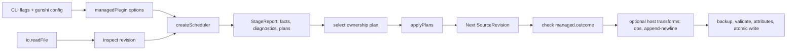

# CLI Host Migration Onto The Retained-Revision Runtime

## Readiness Assessment

**Mostly yes.** The pure runtime and the built-in managed plugin are strong enough
to carry the CLI's reconciliation behavior. Three concrete gaps must close first;
everything else is host plumbing that can be lifted directly.

### What is already proven

- [`createScheduler()`](/src/runtime/scheduler.ts) runs one immutable stage,
  topologically orders passes, exposes direct-dependency facts, and rejects
  registry failures.
- [`managedPlugin()`](/src/plugins/managed/default.ts) now covers update / keep /
  remove / insert / take-over, tag merge and replace, source attribution,
  lossless additive updates, and cross-name anchor ordering.
- The marker scanner already emits the integrity diagnostics that the legacy
  [`detectConflicts()`](/src/conflict-detection.ts) pre-flight reconstructs by
  hand: nested openers, orphan openers and closers, and duplicate blocks.
- [`applyPlans()`](/src/runtime/plans.ts) is the sole splice engine; it already
  reports stale spans, out-of-bounds, overlap, and revision mismatch with full
  originating edit records.

### Gaps that block the migration

1. **Multi-name removal.** `--remove-all` accepts a space-separated list of
   block names and removes every matching envelope in one pass. The current
   managed plugin owns exactly one identity. Options: run one managed plugin
   instance per name with `whenPresent: { kind: "remove" }` (simple, multiple
   schedulers), or add a family-aware removal mode that scans and removes all
   requested names in one stage. The latter is cleaner and matches the
   cross-name anchor scanner we already wrote in
   [`inspectManagedAnchors()`](/src/plugins/managed/anchors.ts).
2. **Orphan removal.** `--remove-orphans` removes blocks whose payload is empty
   or whitespace-only. This is a removal predicate over payload content, not a
   separate mechanism. It composes naturally with multi-name removal as one
   "managed cleanup" pass.
3. **Post-apply text transforms.** Two legacy behaviors operate on the final
   string after reconciliation, not on the revision:
   - `--dos` rewrites every line terminator to CRLF. This is fundamentally a
     lossy whole-document normalization that sits in tension with lossless
     retained source.
   - `--append-newline` inserts one blank line after the block.

   Both should become explicit, opt-in host-side transforms over the applied
   revision text, never plugin behavior. `--dos` in particular deserves an
   honest name and a documented cost.

### What is NOT a blocker

- **Conflict detection** is already a plugin concern. The scanner emits
  integrity facts; the host inspects `report.diagnostics` and decides whether
  to proceed. The legacy pre-flight module can be deleted, not ported.
- **Mode handling** (`ensure` / `only` / `none`) is host-level policy over the
  outcome fact. `ensure` skips writes when the outcome is `kept`; `only` skips
  when a block already exists; `none` always proceeds. No new module is needed.
- **Envsubst, backup, validation, attributes, atomic writes** are I/O effects.
  They belong to the host and should never enter the pure runtime.

## The Pitch: Direct Host Composition

The CLI becomes a thin Node host. No facade, no `processFile`, no
`parseAndInsertBlock`. The pipeline for one file is:



Concretely, the new `block-in-file.ts` does:

1. Parse flags with gunshi (unchanged).
2. For each target file:
   - Read source text via `io.readFile`.
   - Apply envsubst to the input block (host pre-transform).
   - Construct a `managedPlugin(options)` from the resolved flags, including
     tags, source line, anchor, additive policy, and present/missing policy.
   - `inspect(text)` then `scheduler.run(revision)`.
   - If `report.diagnostics` contains integrity failures, stop with an error.
   - Select the `ownership-plan` plan; `applyPlans(revision, [planId], report.plans)`.
   - If the applied result is unchanged, optionally skip the write (`ensure`).
   - Apply optional host transforms (`--dos`, `--append-newline`).
   - Run backup, validate, attributes, and atomic write as host effects.

No `file-processor.ts`. No `block-parser.ts`. No `conflict-detection.ts`. The
[`src/plugins/config.ts`](/src/plugins/config.ts) gunshi plugin survives as the
flag surface; its `extension()` output becomes the source of
`ManagedPluginOptions`.

### What gets deleted

After the migration lands and characterization tests pass:

- [`src/file-processor.ts`](/src/file-processor.ts) — the orchestration facade.
- [`src/block-parser.ts`](/src/block-parser.ts) — the `split("\n")` legacy loop.
- [`src/conflict-detection.ts`](/src/conflict-detection.ts) — superseded by
  scanner integrity diagnostics.
- [`src/mode-handler.ts`](/src/mode-handler.ts) — three lines of host policy.
- [`src/block-remover.ts`](/src/block-remover.ts) — replaced by a managed
  cleanup pass.
- [`src/output.ts`](/src/output.ts) — `formatOutputs` reconstructs endings and
  is replaced by lossless text + optional transforms; `generateDiff` and
  `writeDiff` move into the diff host plugin.
- [`src/managed/default.ts`](/src/managed/default.ts) and
  [`src/managed/markers.ts`](/src/managed/markers.ts) — the legacy
  non-runtime managed planner. Keep only as long as characterization tests
  reference it, then delete.

## Gaps To Close Before Migration

### Gap 1: Managed cleanup pass (multi-name removal + orphans)

Add a `managedCleanupPlugin(options)` (or a `cleanup` mode on the existing
managed plugin) whose scanner recognizes a marker family across multiple
identities and whose planner removes every envelope whose name is in the
requested set, plus optionally every envelope whose payload is empty. This is
the natural extension of the anchor family scanner.

Acceptance:

- removes every named block in one stage;
- reports each removed envelope as evidence;
- optionally removes orphan (empty-payload) blocks regardless of name;
- preserves all other source bytes exactly;
- emits one `managed.cleanup` outcome fact with a count.

### Gap 2: Host-side text transforms

A small, pure `host-transforms.ts` module with two functions:

```ts
export function withDosLineEndings(text: string): string;
export function withTrailingBlankLine(text: string, at: "eof" | offset): string;
```

These operate on the final applied string, never on a revision. They are
opt-in and documented as lossy. `--dos` becomes a compatibility flag with a
clear warning in `--help` that it normalizes the whole document.

### Gap 3: Characterization harness

Before deleting the legacy path, run the existing CLI suites
([`test/block-in-file.test.ts`](/test/block-in-file.test.ts),
[`test/cli.test.ts`](/test/cli.test.ts),
[`test/mode.test.ts`](/test/mode.test.ts),
[`test/additive-cli.test.ts`](/test/additive-cli.test.ts),
[`test/anchor.test.ts`](/test/anchor.test.ts),
[`test/source-attribution.test.ts`](/test/source-attribution.test.ts),
[`test/timestamp-integration.test.ts`](/test/timestamp-integration.test.ts))
through the new host and confirm bytewise output equivalence. These suites
become the migration's safety net.

## Gradient Of Alternatives

These are deliberately spread from minimalist to most generalized. The pitch
above is alternative A.

### A. Minimal direct host (recommended)

The CLI is the only host. Host helpers (backup, validate, attributes, atomic
write, envsubst, transforms) are inline modules in `src/host/`. One package.

- **Strength:** smallest surface, fastest to ship, easiest to keep lossless.
- **Cost:** programmatic users who want file effects must reimplement host
  helpers or call the CLI.
- **Right when:** the library's primary consumer is the CLI.

### B. Host helper toolkit

Extract pure, reusable host utilities into a documented subpath export:
`block-in-file/host` exposing `backupFile`, `runValidation`,
`applyAttributes`, `atomicWrite`, `substituteEnvVars`. The CLI composes them;
programmatic users can too.

```text
src/host/
  backup.ts        pure backup helpers (already mostly pure)
  validation.ts    runValidation (already exists)
  attributes.ts    parseAttributes, applyAttributesSafe (already exists)
  atomic-write.ts  temp + rename, factored out of file-processor
  envsubst.ts      already pure
  transforms.ts    dos, append-newline (new, from Gap 2)
```

- **Strength:** programmatic users get file-effect building blocks without a
  facade; the CLI is one composition among many.
- **Cost:** one extra public boundary to document and version.
- **Right when:** you want the library to be useful to other Node tools that
  mutate files safely, not just this CLI.

### C. Reconciliation job abstraction

A declarative `ReconciliationJob` value that bundles plugins, plan selection,
host transforms, and effect policy. The CLI and programmatic callers both
construct a job and hand it to one `runJob(job, source) -> result` entry
point. Jobs are serializable, so a config file (TOML/JSON) can describe them.

```ts
export type ReconciliationJob = Readonly<{
  plugins: readonly ReconciliationPlugin[];
  select: (report: ScheduledStageReport) => readonly PlanId[];
  transforms?: readonly HostTransform[];
  effects?: readonly HostEffect[];
}>;
```

- **Strength:** enables CI-friendly declarative configs, batch operations, and
  reproducible reconciliation across teams.
- **Cost:** a new abstraction that must earn its keep; risks premature
  generality before a second real host exists.
- **Right when:** there are at least two real hosts (CLI + programmatic + maybe
  an editor plugin) that share job shape.

### D. Multi-revision pipeline runtime

Extend the runtime to support apply-and-reinspect stages within one scheduler
invocation: pass A plans, host applies, pass B inspects the next revision,
emits validation facts. This is the "plan dependency across revisions" gate
named in the retained-revisions design.

- **Strength:** enables validation passes, multi-step workflows, and semantic
  re-checks without host orchestration.
- **Cost:** significantly complicates the scheduler; the design doc explicitly
  defers this until a maintained consumer proves the need.
- **Right when:** the systemd plugin or another semantic plugin needs
  re-inspection after application and host orchestration is painful.

### E. Fact-graph / relational rewrite model

A queryable fact store with a schema, invalidation rules, and multi-file
transactions. The design doc lists this as a deferred direction.

- **Strength:** powerful multi-file and cross-cutting analysis.
- **Cost:** a second system to maintain; premature before single-file
  reconciliation is fully proven.
- **Right when:** there are real multi-file use cases that cannot be expressed
  as independent per-file jobs.

### F. Plugin package ecosystem

Split into independently versioned packages: `@block-in-file/core` (runtime),
`@block-in-file/managed`, `@block-in-file/markdown`, `@block-in-file/host`,
`@block-in-file/cli`. Third-party plugins become their own packages.

- **Strength:** clean versioning, small core, extensible ecosystem.
- **Cost:** release coordination overhead; monorepo tooling; not worth it
  before there are real third-party plugins.
- **Right when:** at least two independently authored plugins exist and
  versioning friction appears.

## Recommended Library Structure

Adopt alternative **B (host helper toolkit)** now, with a clear subpath
layout, but keep everything in one package. Leave **C, D, E, F** explicitly
deferred with the gates above. The proposed module map:

```text
src/
  source/         retained revisions, physical lines, checked spans (done)
  runtime/        origin, facts, plans, stage, scheduler, line-pass (done)
  reconcile/      apply kernel, placement, session (done)
  tags/           tag parsing and mutation (done)
  plugins/
    managed/      built-in managed plugin + anchors (done)
    markdown/     changelog line-fold plugin (done)
  host/           NEW: pure file-effect and transform helpers
    backup.ts       (moved from src/backup.ts)
    validation.ts   (moved from src/validation.ts)
    attributes.ts   (moved from src/attributes.ts)
    atomic-write.ts (factored out of file-processor.ts)
    envsubst.ts     (moved from src/envsubst.ts)
    transforms.ts   (NEW: dos, append-newline)
    input.ts        (moved from src/input.ts)
    diff.ts         (moved from src/output.ts generateDiff/writeDiff)
  toolkit.ts      public pure runtime + plugin exports (done)
  host.ts         NEW: public host helper exports
block-in-file.ts  the CLI host (rewritten)
```

Public entry points:

- `block-in-file` — re-exports `toolkit` + `host` for convenience.
- `block-in-file/toolkit` — pure runtime, plugins, types. Safe for any JS
  runtime, no Node I/O.
- `block-in-file/host` — Node-only file-effect helpers. Explicitly
  side-effectful.

This makes the pure runtime usable in browsers, Deno, workers, and tests
without pulling in `node:fs`, while the CLI and other Node tools get the
helpers they need.

## Modular Library Utility

To make this genuinely useful as a library of utilities, in priority order:

1. **Pure runtime as a first-class public API.** Already done via
   [`src/toolkit.ts`](/src/toolkit.ts). Keep it honest: no Node imports, no
   I/O, no clocks, no filesystem. Document it as the canonical entry point.
2. **Host helpers as a separate public surface** (`block-in-file/host`). Every
   helper is a pure function except where it must touch the filesystem; even
   then, accept injected `io` capabilities (the gunshi `io` plugin already
   does this) so they remain testable.
3. **One canonical example plugin beyond managed and markdown.** The systemd
   plugin (Stage 7 in the retained-revisions design) is the right proof. It
   shows an external parser producing semantic facts and consuming checked
   edits. It can live in a separate repository to keep the core clean.
4. **Plugin authoring guide.** A short document describing the
   `ReconciliationPlugin` contract, when to use `SnapshotLinePass` vs a direct
   pass, how to declare plan names, how to emit evidence, and how diagnostics
   flow. This is the difference between "the runtime is public" and "people
   can actually write plugins."
5. **Stable plan selection and reporting vocabulary.** The managed plugin
   emits `managed.outcome` facts; standardize that pattern so hosts can write
   `if (outcome === "kept") skipWrite()` without coupling to plugin internals.
6. **Deferred: dynamic plugin loading, sandboxing, multi-file transactions.**
   These are the explicit gates in the retained-revisions design. Do not build
   them until a real consumer forces the issue.

## Supporting Work That Would Help

Collected here so the design stays honest about dependencies.

### Before migration

- **Close the three gaps above.** Managed cleanup pass, host transforms, and
  the characterization harness. These are the landing zone.
- **Delete `src/managed/default.ts` and `src/managed/markers.ts` legacy
  planners** once characterization passes. They are dead weight once the
  runtime plugin is the only path. (The runtime plugin's
  [`src/plugins/managed/default.ts`](/src/plugins/managed/default.ts) already
  reimplements their behavior losslessly.)

### During migration

- **Keep the gunshi plugin chain.** The
  [`logger`](/src/plugins/logger.ts), [`config`](/src/plugins/config.ts),
  [`io`](/src/plugins/io.ts), and [`diff`](/src/plugins/diff.ts) gunshi
  plugins are good host boundaries. They stay; only `processFile` goes away.
- **Preserve every existing CLI flag.** No breaking flag changes in this
  migration. `--dos` and `--append-newline` stay as opt-in transforms with
  clearer help text.

### After migration

- **A second plugin to prove the model.** Systemd is the named candidate.
  Even a minimal `systemd-units` integration hosted elsewhere validates that
  the plugin contract is real and not accidentally managed-block-shaped.
- **Plugin authoring guide and one example** in the repository to make the
  library usable to others.
- **Consider alternative C (job abstraction) only if** a second host appears —
  for example, a programmatic API used by an editor integration or a CI runner
  that applies the same job to many files.

### Explicitly deferred

- Multi-revision pipelines inside the scheduler (alternative D).
- Fact-graph / relational model (alternative E).
- Multi-package split (alternative F).
- Dynamic plugin loading and sandboxing.

Each has a gate in the retained-revisions design. Respect those gates.

## Open Questions

1. Should `--dos` be deprecated in favor of a separate `--line-ending crlf`
   flag that is honest about being a whole-document transform? The current
   name implies a property of the block, not the whole file.
2. Should the managed cleanup pass share a scanner with the ownership plugin,
   or run as a separate plugin in the same scheduler stage? Sharing avoids
   double-scanning; separating keeps responsibilities crisp.
3. Is the `block-in-file/host` subpath worth the public boundary now, or
   should host helpers stay un-exported until a programmatic consumer asks?
4. Should `managed.outcome` be standardized as a runtime-level convention
   (every plugin emits one outcome fact) or remain plugin-specific?

## Bottom Line

The CLI migration is close. Close the three gaps — managed cleanup, host
transforms, characterization — then rewrite `block-in-file.ts` as a direct
host over `managedPlugin()` + host helpers. Delete the legacy orchestration.
Adopt alternative B (host helper toolkit) to make the library genuinely
reusable. Defer the more generalized alternatives until real consumers force
them.
