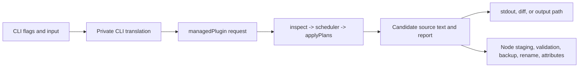

# Direct CLI Hosting Over Retained Reconciliation

## Decision To Make

Should the CLI now migrate from its line-reconstructing `processFile()` path to
the retained-revision runtime, and what reusable library surface should exist
around that migration?

The answer is:

1. We are ready to begin a **staged direct-host migration**.
2. We are not ready to delete the legacy path in one change while claiming full
   CLI compatibility.
3. We should not create `ensureBlock()`, `processFileV2()`, or a generic
   `reconcileFile()` facade.
4. We should first finish a small set of explicit policy modules, then make
   [`block-in-file.ts`](/block-in-file.ts) compose the runtime directly.

The runtime and managed plugin are now substantial enough to be useful to
other callers. The missing work is mostly command policy and Node effects, not
another replacement engine.

## Current Shape

The reusable pure pieces already compose directly:

```ts
const revision = inspect(sourceText);
const scheduler = createScheduler([managedPlugin(options)]);
if (isSchedulerFailure(scheduler)) throw new Error(scheduler.code);

const report = scheduler.run(revision);
const result = applyPlans(
  revision,
  report.plans.plans.map((plan) => plan.id),
  report.plans,
);
```

That path already has useful safety properties:

- revisions, facts, and plans are tied to one source snapshot;
- plugin passes cannot mutate the source they inspect;
- plans apply atomically or preserve attributed conflicts and failures;
- managed ownership, tags, attribution, additive insertion, and anchors are
  now implemented as plugin policies;
- untouched source is retained byte-for-code-unit.

The legacy CLI does not use this path. It builds a large `ProcessContext`, then
[`processFile()`](/src/file-processor.ts) combines parsing, compatibility
policy, output formatting, backup, validation, atomic rename, attributes, and
logging. It ultimately calls [`parseAndInsertBlock()`](/src/block-parser.ts),
which splits and reconstructs the complete file.

## Migration Readiness

### Ready Now

The normal managed-block path has enough pure behavior for a direct host:

- exact managed update, keep, removal, insertion, adoption, and take-over;
- tag-aware marker discovery and opener-only merge/replace rendering;
- host-provided timestamp tags and source-attribution text;
- lossless additive payload updates;
- BOF/EOF anchored insertion across managed names;
- attributed diagnostics, plans, and edit evidence;
- checked application and no-op reporting.

This is enough to build an integration test host and migrate the ordinary
single-block command path before deleting anything.

### Required Before A Full CLI Cutover

These are compatibility gates, not reasons to redesign the pure runtime.

| Gap | Correct home | Why it matters |
| --- | --- | --- |
| `--append-newline` | Managed render policy | It is adjacent to the managed envelope, so a host suffix would be ambiguous at EOF and around other content. |
| `--remove-all` and `--remove-orphans` | Separate managed cleanup plugin | Cleanup deliberately acts on many blocks and malformed shapes; it should not weaken the normal single-owner scanner. |
| `--dos` and legacy final newline | Explicit host serializer | Global normalization intentionally abandons retained-source preservation and must not be hidden in `applyPlans()`. |
| `--before` / `--after` legacy selection | CLI translation policy | The runtime placement API requires a unique match, while the legacy command chooses the first match and falls back to EOF. |
| Modes | CLI write-decision policy | `ensure`, `only`, and `none` have historical write semantics that are not generic plugin semantics. |
| Diagnostics | CLI error policy | The runtime faithfully reports diagnostics; the command must decide which prevent writing. |
| Diff, backup, validation, atomic writes, attributes | Node host | These are effects, not plugin capabilities. |

There are also decisions that need characterization before compatibility is
claimed:

- `ensure` historically ignores a timestamp/source-metadata-only difference;
  the managed plugin can observe it. We should either preserve that old rule or
  explicitly change it and document the change.
- `--dos` currently globally reconstructs output and supplies a final newline.
  A retained revision should not do that accidentally.
- The current output value `--` is documented as no output but appears to take
  the overwrite path. This needs a behavior decision, not replication by
  accident.
- The old anchor implementation has weak multi-name and multi-priority
  behavior. The plugin's whole-block priority ordering is the intended new
  behavior and needs CLI characterization tests.

## Non-Goals

- No plugin receives filesystem, environment, clock, subprocess, logger, or
  stdout capabilities.
- No generic mutable `FileReconciler` object that hides source reads, plugin
  selection, diagnostics, and writes.
- No automatic rule that every diagnostic prevents application in every host.
- No multi-file transaction promise. Each target remains an independent
  revision and one independent Node effect sequence.
- No immediate public pipeline framework merely because the CLI has stages.

## Design Gradient

These designs are deliberately distinct. They are not a menu of names for the
same wrapper.

### A: Direct CLI Host

The CLI owns the whole assembly explicitly. It translates flags to a managed
plugin request, runs one scheduler stage, selects the current invocation's
plans, applies them, then performs effects.

```ts
const request = toManagedRequest(config, preparedInput, target);
const revision = inspect(original);
const scheduler = createScheduler([managedPlugin(request)]);
const report = scheduler.run(revision);

if (report.diagnostics.length > 0) throw renderDiagnostics(report.diagnostics);

const application = applyPlans(revision, selectCliPlans(report), report.plans);
await writeCliResult({ original, application, config, target });
```

`toManagedRequest`, `selectCliPlans`, and `writeCliResult` are private CLI
functions. They are deliberately visible in the command source rather than
being wrapped in an attractive but shallow `ensureBlock()` method.

What it hides: only ordinary local detail, such as CLI string parsing and the
temporary-file sequence.

Strengths:

- smallest path to safely replacing the current CLI core;
- no new public abstraction to regret;
- makes flag-to-policy decisions reviewable;
- keeps the existing toolkit useful for external callers today.

Costs:

- another Node command would initially repeat a little assembly code;
- the CLI entry point needs a few well-named private helpers instead of one
  procedural `processFile()` function.

### B: Pure Reconciliation Program

Add a pure, multi-stage composition utility only after a second maintained
consumer needs apply-and-reinspect sequencing, such as systemd validation.

```ts
export type ReconciliationStep = Readonly<{
  id: string;
  plugins: readonly ReconciliationPlugin[];
  select(report: ScheduledStageReport):
    | Readonly<{ kind: "apply"; plans: readonly PlanId[] }>
    | Readonly<{ kind: "halt"; reason: string }>;
}>;

export type ReconciliationProgram = Readonly<{
  run(revision: SourceRevision): ProgramResult;
}>;

export function compileProgram(
  steps: readonly ReconciliationStep[],
): ReconciliationProgram | SchedulerFailure;
```

The program has no Node imports and does not decide that diagnostics are
errors. Each caller supplies plan selection and halt policy.

What it hides: scheduler construction, selected-plan application, fresh
revision creation, and a history of applied stage reports.

Strengths:

- useful for a systemd parse -> rewrite -> reparse validation workflow;
- provides an honest reusable abstraction around cross-revision sequencing;
- still avoids a file-oriented facade.

Costs:

- premature if the CLI remains a one-stage managed operation;
- selection and halt semantics become public API before two consumers prove
  them;
- can turn into a thin pass-through if introduced only to avoid direct calls.

### C: Node Effect Primitives

Keep reconciliation direct, but factor the repeatable file effect protocol
into small Node utilities under a separate package export.

```ts
export type StagedWrite = Readonly<{
  target: string;
  temporary: string;
  commit(): Promise<void>;
  discard(): Promise<void>;
}>;

export async function stageAtomicWrite(
  target: string,
  text: string,
  options: AtomicWriteOptions,
): Promise<StagedWrite>;

export async function validateStaged(
  staged: StagedWrite,
  command: string,
): Promise<void>;
```

Potential package boundary:

```text
block-in-file/toolkit  retained revisions, plugins, plans, pure helpers
block-in-file/node     staging, validation, backup, attributes, output sinks
block-in-file          current root compatibility exports
```

What it hides: temporary naming, cleanup, backup choreography, subprocess
invocation, and attribute application.

Strengths:

- makes the useful Node effect protocol reusable without coupling it to blocks;
- eliminates duplicated normal/remove write paths;
- works with direct CLI hosting or a future reconciliation program.

Costs:

- package export design and error contracts need deliberate API review;
- this can become over-general infrastructure if it tries to abstract every
  filesystem backend immediately.

### D: Public File Reconciliation Facade

For contrast, the tempting design is:

```ts
await reconcileFile({ path, plugin, validate, backup, output });
```

This is not recommended now.

It hides too many policy decisions:

- whether diagnostics halt;
- which named plans to select;
- whether a no-op still writes;
- how output/diff/stdout modes interact;
- whether a post-apply serializer changes otherwise retained bytes;
- file-change/concurrency policy between read and rename.

It would look small while forcing unrelated consumers into CLI-specific rules.
That is a shallow facade, not a deep module.

## Recommendation

Adopt A now, prepare C as a narrowly scoped follow-up, and defer B until the
systemd plugin or another maintained consumer proves the need for multiple
apply-and-reinspect stages.



The library remains usefully modular without a facade:

| Layer | Public usefulness | Deliberately does not know |
| --- | --- | --- |
| Source/runtime | revision safety, facts, scheduler, plans | marker syntax, files, clocks, processes |
| Managed plugin | block ownership and policy | CLI flags, paths, environment, writes |
| Changelog plugin | heading-based deferred edits | files and managed blocks |
| Node primitives | safe file-effect building blocks | plugin selection and marker policy |
| CLI | one concrete UX | a new generic library protocol |

## Proposed Migration Sequence

1. Add managed `trailingBlankLine` behavior with lossless fixtures.
2. Add a managed cleanup plugin for `remove-all` and orphan removal.
3. Write a CLI translation module that converts parsed flag values into:
   - literal managed content after environment substitution;
   - timestamp/tag values;
   - source attribution text and prefix;
   - additive policy;
   - anchor policy;
   - missing-block placement or legacy first-match offset.
4. Extract private CLI functions for one-stage run, diagnostic rendering, and
   write-decision policy. Do not export them yet.
5. Route one normal managed update path through the runtime behind
   characterization tests, leaving removal and DOS on legacy code temporarily
   if needed.
6. Route cleanup and output modes through their explicit policies.
7. Replace the `processFile()` call site in the CLI and delete the legacy parser
   path only after all CLI matrix tests pass.
8. Reassess whether Node effect primitives deserve `block-in-file/node` after
   the migration has exposed real repetition.

Each step should be independently commit-worthy and leave a runnable CLI.

## Test Matrix

The migration should add CLI-level characterization tests rather than relying
only on pure plugin tests:

- unchanged, payload-changed, tag-changed, timestamp-changed, and source-line
  changed states for `ensure`, `only`, and `none`;
- missing blocks at BOF, EOF, first legacy regex match, no match, and many
  matches;
- normal, additive, tagged, anchored, and source-attributed blocks;
- malformed markers and duplicate ownership diagnostics with no write;
- `remove-all` names, duplicates, and orphans;
- LF, CRLF, lone CR, mixed endings, Unicode prefixes, and absent final newline;
- explicit `--dos` and `--append-newline` policy behavior;
- stdout, no-output, diff, alternate output, backup, validation failure,
  temporary-file cleanup, atomic rename, and post-write attributes;
- sequential multi-file partial failure behavior.

## Support For Later Work

### Systemd And Other Semantic Plugins

Do not force parser-backed integrations through the managed plugin. A systemd
plugin should emit directive facts, produce one checked plan, apply it, then
run a new parse/validation stage. That is the strongest evidence needed before
introducing the pure reconciliation-program abstraction in design B.

### Third-Party Plugin Authors

The useful contract is already the pure toolkit: source revisions, pass
descriptors, facts, diagnostics, named plans, and checked edit intents. They
should not depend on CLI configuration or Node I/O. A future plugin-loading
convention can be designed after two independently packaged plugins establish
real requirements.

### Other Node Consumers

If another command, service, or editor integration repeats staging, validation,
backup, and rename logic, extract C as `block-in-file/node`. Keep its API about
one approved candidate text and one target path, not about markers or plugins.

### Other Runtimes

The toolkit remains TypeScript and platform-neutral. A browser, Deno, Bun, or
worker consumer can run plugins and apply plans against strings without taking a
dependency on Node effects. Platform adapters belong at separate entry points.

## Open Decisions

1. Should `ensure` retain its historical behavior of ignoring metadata-only
   changes, or should it mean that the fully rendered managed block is current?
2. Should legacy first-match placement remain a CLI-only compatibility behavior,
   while toolkit placement stays unique-or-error? This draft recommends yes.
3. Is global `--dos` normalization still a desired feature, or should it be
   deprecated in favor of lossless source retention plus generated-content
   terminator inheritance?
4. Should cleanup be a first-class named plan in one managed plugin, or a
   separate cleanup plugin with intentionally different cardinality semantics?
   This draft recommends a separate plugin.
5. When a target changes after the CLI read it but before atomic rename, should
   the host provide optimistic conflict detection or document last-writer-wins?

## Bottom Line

We should migrate the CLI, but the migration should not create a new facade.
The command is a direct, readable Node host over a useful pure library. Finish
the few remaining policy gaps, prove the CLI matrix, and let a future systemd
workflow determine whether a reusable multi-stage program is justified.
