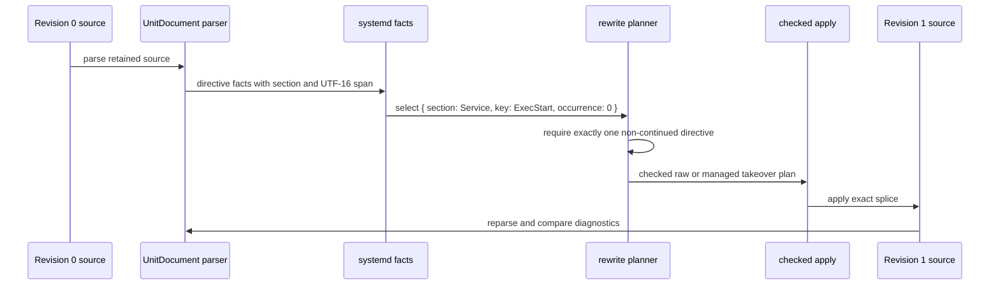

# Retained Revisions, Facts, And Checked Rewrite Passes

## Decision

Generalize `block-in-file` around **immutable retained source revisions**, not
around marker blocks and not around a forward-mutating line stream.

Each revision retains its exact JavaScript string and physical-line index. A
consumer may derive revision-bound facts from that source using any mechanism:
a line fold, a host parser, a regular expression, or a whole-document analysis.
Planners consume one revision and its facts, emit checked edit intents against
that same revision, and the runtime validates and applies them as one new
revision. Dependent work explicitly starts from the new revision.

Managed blocks become one maintained assembly over this model. They remain a
first-class easy path, but they are no longer the reference frame for every
operation. A physical-line transducer becomes an optional **snapshot line-fold
planner**, not the mandatory product model.

## Why Change Direction

The current implementation has a real generic kernel:

- [`apply()`](/src/reconcile/apply.ts) validates checked spans, rejects overlap,
  and splices right to left.
- [`inspect()`](/src/document/inspect.ts) retains source and indexes physical
  lines without reconstructing it.
- [`beginReconciliation()`](/src/reconcile/session.ts) creates fresh immutable
  documents after each successful step.

But its most visible public behavior is still a block-oriented facade:
[`planBlock()`](/src/managed/default.ts) discovers marker regions and renders
marker envelopes. Raw replacement exists largely as the absence of marker
ownership. That framing is too narrow if the library is intended to help a
consumer reason about configuration files, prose, and parser-selected regions
without treating each as a special case of a block.

The stream-processor exploration correctly identifies a missing capability:
state accumulated while visiting source can decide to emit an edit later. Its
literal `Processor<State, Fact, Edit>` proposal is not yet a safe foundation.
It leaves the important semantics implicit: revision ownership, EOF behavior,
inter-pass visibility, fact provenance, and overlap resolution.

## The Core Model

### Revisions Are Coordinate Universes

Every offset, line, span, fact, and planned edit belongs to exactly one source
revision. A revision is immutable. It never gains a shifted coordinate system;
an applied plan creates another revision instead.

```ts
export type RevisionId = string & { readonly revision: unique symbol };

export type SourceRevision = Readonly<{
  id: RevisionId;
  text: string;
  lines: readonly PhysicalLine[];
}>;

export type RevisionSpan = Readonly<{
  revision: RevisionId;
  start: number;
  end: number;
}>;
```

`RevisionId` is an opaque runtime identity, not a content hash promise. Two
separately inspected equal strings may have distinct identities. This prevents
callers from accidentally applying a span or fact from an older revision simply
because its text happens to look similar.

The current `Document` is the beginning of `SourceRevision`. The refinement is
to make revision affinity explicit at public boundaries rather than relying on
callers to remember which `text` produced a numeric offset.

### Facts Are Evidence, Not A Global Object Store

A fact is an observation about one revision. It may be located, document-wide,
or supplied by a host parser. A fact batch keeps it attached to its revision
without requiring a mutable fact database or a universal schema.

```ts
export type Fact<Kind extends string, Value> = Readonly<{
  kind: Kind;
  subject?: RevisionSpan;
  value: Value;
  origin: string;
}>;

export type FactBatch<FactValue> = Readonly<{
  revision: RevisionId;
  facts: readonly FactValue[];
  diagnostics: readonly InspectDiagnostic[];
}>;
```

Examples:

- a marker scanner emits `managed-block` facts with envelope and payload spans;
- a line fold emits `heading`, `blank-line`, or `fence` facts;
- a systemd adapter emits `systemd.directive` facts with section, key,
  occurrence, continuation state, and a converted source span;
- a whole-document check emits a `missing-license` fact with no local subject.

Facts do not silently persist into another revision. A planner may only consume
fact batches with the same revision identity as its document. A later revision
must be analyzed again. This makes stale-source behavior a normal type and
runtime condition instead of hidden offset arithmetic.

### Edits Are Checked Actions With Provenance

An edit reaches the mutation boundary only as a checked range against the
revision's retained string. The existing `PlannedEdit` shape already provides
the required `expected` snapshot. A generalized form adds explanation, not a
new application mechanism.

```ts
export type EditIntent = Readonly<{
  revision: RevisionId;
  range: CheckedSpan;
  replacement: string;
  reason: string;
  origin: string;
  evidence?: readonly string[];
}>;

export type RewritePlan = Readonly<{
  revision: RevisionId;
  edits: readonly EditIntent[];
}>;
```

`origin` names the assembly or pass that made the decision. `evidence` is a
future-friendly link to the facts used to make it. Neither authorizes an edit:
the runtime still checks bounds, exact expected text, and non-overlap before
splicing. Coincident insertions and overlapping transformations remain a
structured conflict, never an implicit processor-order rule.

### Passes Read Snapshots And Produce Results

A pass does not mutate its input. It receives a revision and explicitly supplied
facts, then produces more facts, diagnostics, and optionally a plan.

```ts
export type PassContext<Facts> = Readonly<{
  revision: SourceRevision;
  facts: Facts;
}>;

export type PassResult<NewFacts> = Readonly<{
  facts?: readonly NewFacts[];
  diagnostics?: readonly InspectDiagnostic[];
  plan?: RewritePlan;
}>;

export type SnapshotPass<InputFacts, NewFacts> = Readonly<{
  name: string;
  run(context: PassContext<InputFacts>): PassResult<NewFacts>;
}>;
```

This is intentionally not a public plugin ABI yet. It is the internal
organizing model for maintained assemblies. Its important rule is simple:
**all facts and all edits from one pass describe the input revision, and that
pass cannot observe its own edits.**

If pass B must observe pass A's result, the coordinator applies A's plan,
inspects revision B, then invokes B against its fresh facts. This is the useful
part of the existing `ReconciliationSession`, made explicit.

## Where A Transducer Fits

Physical lines remain valuable because they are exact, exhaustive source
coordinates and make scoped, deferred decisions easy. The promoted form should
be a snapshot fold with an EOF hook, not a rewriting stream:

```ts
export type SnapshotLinePass<State, FactValue> = Readonly<{
  name: string;
  initial(revision: SourceRevision): State;
  line(state: State, line: PhysicalLine, emit: LineEmitter<FactValue>): State;
  finish(state: State, emit: LineEmitter<FactValue>): void;
}>;

export type LineEmitter<FactValue> = Readonly<{
  fact(fact: FactValue): void;
  edit(edit: EditIntent): void;
  diagnostic(diagnostic: InspectDiagnostic): void;
}>;
```

This has the desired transducer-like property: state can hold a pending action
when a trigger is encountered and emit it on a later line or at EOF. It does
not have a mutable streaming-output claim. Every emission remains anchored to
the input revision, then becomes part of one checked plan. No emitted edit
changes the lines seen later in the same pass.

`finish()` is mandatory. It is where a pass can emit a deferred EOF insertion,
report an unclosed fence, or reject an incomplete scope. A bare
`advance(state, line)` processor cannot express those cases correctly.

## Grounding: A Systemd `ExecStart` Rewrite

The model does not ask a generic line walker to understand systemd. The systemd
parser remains semantic authority.



Concretely:

1. `UnitDocument` reads `[Service]` while parsing and keeps that section as
   context for each directive. The generic library does not need to discover
   the header itself.
2. The N-API adapter exposes each directive's whole source range as UTF-16
   code-unit offsets. It includes directive indentation and trailing whitespace
   but excludes the physical terminator.
3. The systemd assembly turns that record into a revision-bound
   `systemd.directive` fact. Its selection policy is explicit:
   `{ section: "Service", key: "ExecStart", occurrence: 0 }` must resolve to
   exactly one fact.
4. A planner derives `CheckedSpan.expected` from the retained revision text and
   emits a raw replacement or a line-aligned managed take-over intent.
5. Applying the plan creates revision 1. The assembly reparses revision 1 and
   rejects a new diagnostic, a continued directive, ambiguity, or a result
   outside the requested section.

The answer to “where does `ExecStart=` go?” is therefore not “after a generic
forward walker sees `[Service]`.” It is “the systemd parser produces a directive
fact whose section context and source range prove exactly where it is.” A line
pass can model simpler header formats; it must not displace a host parser when
one already knows the syntax.

## Variations Considered

| Direction                                  | Strength                                                                                                         | Cost and reason not to choose as spine                                                                                                          |
| ------------------------------------------ | ---------------------------------------------------------------------------------------------------------------- | ----------------------------------------------------------------------------------------------------------------------------------------------- |
| Forward rewriting transducer               | Natural deferred emission and streaming intuition.                                                               | Edits change later coordinates, parser facts cannot participate naturally, and same-pass visibility is difficult to define. Reject as the core. |
| Retained-revision facts and checked passes | Works for line folds, parser adapters, regex/whole-document analysis, and blocks. Reuses the correctness kernel. | Requires explicit revision and plan provenance. **Recommended.**                                                                                |
| Fact graph or relational rewrite database  | Powerful queries, dependencies, multi-file coordination, explanation.                                            | Requires a schema, query language, invalidation model, and transaction design before evidence. Defer.                                           |
| Full editor or syntax-tree framework       | Strong structural transformations.                                                                               | Recreates format parsers and abandons lossless text as the shared denominator. Reject.                                                          |
| Public plugin/event framework              | Extensible by third parties.                                                                                     | Freezes lifecycle and conflict semantics before maintained assemblies have established them. Defer.                                             |

## Annealing Plan

1. **Make revision affinity real internally.** Introduce opaque revision IDs and
   revision-bound source spans, fact batches, and plans. Retain existing public
   conveniences while the internals settle.
2. **Separate assemblies from the kernel.** Move marker ownership behind a
   managed assembly boundary. The root package may keep it as the default
   facade; `block-in-file/toolkit` becomes the honest general entry point.
3. **Ship the systemd assembly.** It is the first proof that externally parsed
   semantic facts can become checked generic edits without teaching the kernel
   systemd semantics.
4. **Write one non-parser line-fold assembly.** A Markdown changelog editor is
   a good probe: it tracks headings, waits for a later boundary, and emits a
   deferred insertion. Keep its pass type private.
5. **Compare the two assemblies.** Promote `SnapshotLinePass` only if the
   Markdown assembly's collector and the managed scanner share a stable shape.
   Do not force the systemd parser through it.
6. **Characterize conflicts and reports.** Before public pass APIs, prove facts
   and edits from independent passes report origins, stale revisions, EOF
   decisions, Unicode spans, mixed terminators, and overlap conflicts
   deterministically.

## Consequences

- The library can still satisfy ordinary `block-in-file` callers. Managed blocks
  are a pre-built rewrite assembly, not a discarded feature.
- “Arbitrary things while walking a file” becomes possible through snapshot line
  folds with deferred emissions, without corrupting coordinate semantics.
- Host parsers are welcome fact producers. The core need not choose between
  physical lines and semantic structure.
- A real public processor framework remains deferred, but its eventual shape is
  constrained by explicit principles rather than only two accidental examples.
- The next work is foundational, not another mode flag: revision-bound facts,
  edit provenance, and assembly boundaries.

## Open Questions

1. Should `RevisionId` be an opaque incrementing runtime token, or should a
   content fingerprint be separately available for reporting and caching?
2. Is edit provenance sufficient as strings initially, or should maintained
   assemblies use structured origin records from the beginning?
3. Should a pass be allowed to return one plan only, or a named set of plans
   with an explicit dependency graph? Begin with one plan and fresh revisions.
4. Can two independently useful line-fold assemblies demonstrate the same
   `SnapshotLinePass` collector without turning it into a plugin framework?

## Bottom Line

The principled generalization is not “blocks with more options” and not an
eager mutable transducer runtime. It is a **lossless retained-revision rewrite
library**: source revisions carry coordinates; facts describe evidence about a
revision; checked edits explain and prove transformations; passes explicitly
cross revision boundaries.

That model subsumes managed blocks, supports the systemd parser bridge, and
leaves room for transducer-like line folds where they are genuinely the right
assembly.

# Addendum: Plugin Runtime And Structured Origins

## Revised Decision

The plugin framework is a product requirement. This supersedes the earlier
recommendation to defer a public plugin ABI until two maintained consumers
converge. We will deliberately design and ship a narrow plugin runtime now,
because extensible source analysis and rewrite behavior is part of what this
library is for.

The retained-revision model remains the safety boundary. Plugins are not given a
mutable source stream, filesystem access, or a way to shift another plugin's
coordinates. They receive a source revision, explicitly available facts, and
runtime-owned collectors for facts, diagnostics, and edit intents.

`PassContext` and `SnapshotPass` are therefore needed. `PassResult` remains
useful only for ordinary summaries; it is not the mutation protocol. A plugin
pass cannot return arbitrary unproven edit data and cannot forge its own
provenance.

## Plugin Shape

```ts
export type PluginManifest = Readonly<{
  id: string;
  version: string;
  title: string;
}>;

export type PassDescriptor = Readonly<{
  id: string;
  title: string;
  after?: readonly PassReference[];
}>;

export type PassReference = Readonly<{
  plugin: string;
  pass: string;
}>;

export type ReconciliationPlugin = Readonly<{
  manifest: PluginManifest;
  passes: readonly ReconciliationPass[];
}>;

export type ReconciliationPass = Readonly<{
  descriptor: PassDescriptor;
  run(context: PassContext): void;
}>;
```

Plugin IDs are stable, namespaced strings selected by the plugin author, such
as `org.example.systemd` or `@systemd-units/reconcile`. Pass IDs are stable
within one plugin. The runtime addresses a pass by the pair, never by a display
title or a JavaScript object identity.

Plugin loading is a Node assembly concern. The pure runtime accepts already
constructed plugin values and performs no module loading, environment lookup,
file read, logging, or clock acquisition.

## Structured Origins

Every fact, diagnostic, plan, and edit receives runtime-owned structured
provenance. A plugin supplies its manifest and the runtime knows the active
pass; neither is accepted as caller-controlled string metadata on an emission.

```ts
export type Origin = Readonly<{
  plugin: Readonly<{
    id: string;
    version: string;
  }>;
  pass: string;
  rule?: string;
  invocation: string;
}>;

export type FactId = string & { readonly fact: unique symbol };
export type EditId = string & { readonly edit: unique symbol };
export type PlanId = string & { readonly plan: unique symbol };
```

`invocation` is generated by the runtime for one pass execution against one
revision. It makes reports unambiguous when a pipeline deliberately invokes the
same pass more than once. `rule` is an optional plugin-supplied stable subrule
identifier, for example `directive-selection` or `append-under-heading`.

The runtime owns `FactId` and `EditId`, which permits an edit to name exactly
which observed facts justify it. Origin records should be report data and
debugging data from the first release, not a later retrofit.

## Capability-Limited Context

```ts
export type PassContext = Readonly<{
  revision: SourceRevision;
  facts: FactQuery;
  emit: PassEmitter;
}>;

export type PassEmitter = Readonly<{
  fact<Value>(
    input: Readonly<{
      kind: string;
      subject?: SourceSpan;
      value: Value;
      rule?: string;
    }>,
  ): FactId;
  diagnostic(
    input: Readonly<{
      code: string;
      message: string;
      subject?: SourceSpan;
      rule?: string;
    }>,
  ): void;
  edit(
    input: Readonly<{
      plan?: string;
      range: CheckedSpan;
      replacement: string;
      reason: string;
      evidence?: readonly FactId[];
      rule?: string;
    }>,
  ): EditId;
}>;
```

The emitter adds the active revision identity and `Origin`; it rejects a span
outside the retained source before an edit can enter a plan. A plugin has no
`apply()` capability. It cannot mutate the revision it is inspecting, observe
another pass's later source, or silently bypass checked-span validation.

`FactQuery` exposes only fact batches that belong to the current revision and
that the scheduler has made available. A first version may use simple typed
predicates and explicit fact kinds rather than inventing a graph-query
language. Plugin TypeScript types improve local authoring; runtime fact kinds
and revision checks remain authoritative across separately compiled plugins.

## Pass Results And Line Folds

The emitter, rather than a returned mutable result bag, is the primary effect
surface. `run()` returns `void` because facts, diagnostics, and edit intents are
already collected with their origin and revision. A pass may return an ordinary
summary value for its own caller, but summaries are not part of the rewrite
protocol.

`SnapshotLinePass` remains a convenience implementation of
`ReconciliationPass`:

```ts
export type SnapshotLinePass<State> = Readonly<{
  descriptor: PassDescriptor;
  initial(context: PassContext): State;
  line(state: State, line: PhysicalLine, context: PassContext): State;
  finish(state: State, context: PassContext): void;
}>;
```

The runtime adapts this to `run()`: it calls `initial`, visits every physical
line in retained order, then calls `finish`. Emitted edits all target the same
input revision. This is transducer-like stateful traversal with deferred
emission, but never an evolving rewrite stream.

Whole-document and parser-backed plugins use `ReconciliationPass` directly;
they do not need to pretend their semantics are line folds.

## Named Plans

Multiple named plans are part of the model now, even though rich selection,
inter-plan dependencies, and partial application are not immediate priorities.

```ts
export type PlanDescriptor = Readonly<{
  name: string;
  title: string;
  description?: string;
}>;

export type PlanReport = Readonly<{
  id: PlanId;
  descriptor: PlanDescriptor;
  origin: Origin;
  revision: RevisionId;
  edits: readonly EditIntent[];
}>;
```

The runtime creates an implicit `default` plan for every pass. `emit.edit()`
uses it unless the plugin supplies a declared plan name. The first scheduler
only supports applying one selected plan set against one revision; it collects
all selected edits, rejects overlap, and produces one checked apply result.

This establishes stable names and report structure now without prematurely
committing to a plan dependency graph. A future `dependsOn` relationship must
be explicit about whether it means ordering within one immutable revision or a
required apply-and-reinspect transition. The latter is a revision-pipeline
dependency, not merely an edit priority.

## Systemd And Managed Blocks As Plugins

The systemd integration is a parser-backed plugin:

1. Its pass parses the revision through `UnitDocument`.
2. It emits `systemd.directive` facts with section, key, occurrence,
   continuation state, and exact UTF-16 source spans.
3. Its planner pass queries an explicitly selected directive fact, rejects
   ambiguity and unsupported continuation, and emits a checked raw replacement
   or managed take-over into a named plan.
4. A validation pass reparses the next revision after application and reports a
   diagnostic delta.

The managed-block integration is another plugin or built-in plugin. Its scanner
emits marker facts and diagnostics; its planner creates managed insert, update,
adopt, take-over, and remove intents. The CLI becomes a Node host that loads
this built-in plugin, translates flags into plugin configuration, selects a
plan, and writes the resulting revision.

Neither plugin owns coordinate application. Both use the same fact, origin,
plan, and checked-edit protocol.

## Scheduler Rules

The first runtime must guarantee:

1. All passes in one stage inspect the exact same immutable revision.
2. A pass sees only declared or scheduler-provided facts from that revision.
3. Every emitted fact, diagnostic, plan, and edit has a revision identity and
   structured origin.
4. Every edit is checked against retained source before application.
5. Selected plans apply atomically or return structured stale-span,
   out-of-bounds, or overlap failures with all originating records intact.
6. A pass that needs transformed source runs only after an explicit apply,
   re-inspection, and new fact-production stage.

The first runtime does not promise asynchronous pass execution, dynamic module
discovery, a query language, automatic conflict merging, untrusted-plugin
sandboxing, or multi-file transactions. Those are future host or scheduler
capabilities, not omissions from the correctness core.

## Revised Implementation Order

1. Add internal `RevisionId`, structured `Origin`, fact IDs, edit IDs, and plan
   IDs to the retained-source kernel.
2. Introduce the runtime collector and a synchronous pass scheduler for one
   revision and its implicit default plans.
3. Port marker ownership into the built-in managed plugin without changing its
   user-facing block-in-file facade.
4. Implement the systemd plugin against the newly exposed directive ranges.
5. Add `SnapshotLinePass` as a built-in adapter and prove deferred EOF and
   later-boundary edits with a Markdown or changelog plugin.
6. Extend named-plan selection and only then consider inter-plan dependencies,
   Node plugin loading conventions, and sandboxing.

## Consequence

The library now has a deliberate general product direction: a pure, retained
source reconciliation runtime for plugins that emit revision-bound facts and
checked edit intents. Blocks remain a fully supported built-in plugin, not the
limit of the model. The plugin contract is constrained enough to preserve
lossless correctness while broad enough for semantic parsers, physical-line
folds, and future host integrations.

# Addendum: Case Study - Original Managed Block Workflow

## Purpose

The generalized plugin runtime must not make the original purpose of
`block-in-file` harder or less legible. A caller who wants to ensure named,
visible generated content in one file should still receive one familiar
operation, one reviewable result, and at most one external write.

Managed blocks are therefore a built-in plugin and default facade, not an
example application that users must reimplement with low-level passes.

```ts
const result = await ensureBlock({
  file: "/etc/example.conf",
  block: {
    name: "example-agent",
    dialect: hashCommentMarkers,
    content: "agent.enabled=true\nagent.port=8080",
  },
  whenPresent: { kind: "update" },
  whenMissing: { kind: "insert", placement: { kind: "edge", edge: "EOF" } },
});
```

The facade is assembly code. Internally it configures the managed plugin,
selects its default named plan, previews or applies it, and delegates the one
file write to the Node host. Ordinary callers never need to name a revision,
fact, pass, plan, or origin record.

## Input Revision

Consider this retained source revision with deliberately mixed concerns:

```text
# maintained by an administrator
server.listen=127.0.0.1:8080

# example-agent start [timestamp:2026-07-29T12:00:00Z]
agent.enabled=false
# example-agent end
```

The desired content is:

```text
agent.enabled=true
agent.port=8080
```

The source text, its physical terminators, the final-newline state, and every
UTF-16 coordinate are retained in revision 0. No plugin begins by splitting
lines and reconstructing the file.

## Managed Plugin Passes

The managed plugin has a small internal pipeline. Each pass reports structured
origins such as:

```ts
{
  plugin: { id: "block-in-file/managed", version: "2" },
  pass: "marker-scan",
  rule: "tag-stripped-identity",
  invocation: "...",
}
```

### 1. Marker Scan

`marker-scan` walks physical lines in the retained revision and emits a
`managed-block` fact for each complete marker envelope. The fact includes:

- the tag-stripped identity, `example-agent`;
- opener, payload, closer, and complete-envelope spans;
- parsed marker metadata such as timestamp tags;
- the exact line terminator around the envelope; and
- a structural diagnostic if the source has duplicate identities, nesting,
  orphan markers, or mismatched pairs.

This is a snapshot line-fold pass. It needs `finish()` to report an opener that
remains unclosed at EOF. It emits facts and diagnostics only; it does not
rewrite the file while scanning.

### 2. Ownership Planner

`managed-ownership` queries for exactly one `managed-block` fact with the
requested identity. It applies the request's visible policy:

| Observed state                        | Request policy           | Result                                                                 |
| ------------------------------------- | ------------------------ | ---------------------------------------------------------------------- |
| One valid block and changed payload   | `whenPresent: update`    | Checked replacement of the envelope or payload.                        |
| One valid block and identical payload | `whenPresent: update`    | Empty plan and `kept`/no-change report.                                |
| One valid block                       | `whenPresent: keep`      | Empty plan and `kept` report.                                          |
| One valid block                       | `whenPresent: remove`    | Checked deletion of the exact envelope.                                |
| No block                              | `whenMissing: insert`    | Checked point insertion at an explicit placement fact or edge.         |
| No block and selected known source    | `whenMissing: take-over` | Checked span replacement with a rendered envelope.                     |
| No block and selected known source    | `mode: adopt`            | The same envelope operation, retaining the selected payload unchanged. |
| Duplicate or malformed markers        | Any mutation policy      | Structured integrity failure; no plan.                                 |

For the example, the planner emits one checked replacement intent. Its
`expected` range is the exact old envelope from revision 0, including the
timestamped opener. Its replacement renders the requested markers and desired
payload using the selected generated-content line-ending policy. The intent
records evidence pointing to the discovered `managed-block` fact.

The runtime collects this intent in the managed plugin's implicit `default`
plan. A future caller may select a specifically named maintenance plan, but the
ordinary facade need not expose that choice.

### 3. One Checked Application

The runtime validates that the revision identity, bounds, and expected envelope
still match. It rejects an overlapping intent from another selected plugin
rather than silently choosing one. On success, it applies all selected edits
right to left and creates revision 1:

```text
# maintained by an administrator
server.listen=127.0.0.1:8080

# example-agent start
agent.enabled=true
agent.port=8080
# example-agent end
```

Every source code unit outside the old envelope is identical to revision 0.
The runtime report contains the managed plugin's structured origin, the fact
that justified the action, the named plan, changed spans, and outcome
`updated`.

The Node host may now preview a diff, make a backup, run an external validator,
and atomically write revision 1. Those are host effects. The plugin and pure
runtime have performed no I/O.

## Idempotence Is Still A First-Class Result

On the next invocation, the marker scan produces the block fact from revision

1. The ownership planner sees that its desired rendered payload is already
   present and emits no edit intent. The selected plan reports `changed: false`
   and `outcome: kept` or `updated`-as-no-op according to the facade vocabulary.

The host therefore does not write the file. Idempotence is not an incidental
property of a forward text stream; it follows from a fact about a retained
revision and a planner that proves the desired state already exists.

## What Generalization Does Not Change

The user-visible behavior remains recognizably `block-in-file`:

- named marker blocks are visible durable ownership;
- updates, inserts, adoptions, take-overs, and removals remain explicit;
- tags, timestamps, attribution, additive behavior, anchors, and placement are
  managed-plugin policies rather than runtime modes;
- source outside a checked change remains lossless;
- one command can still produce one preview and one write.

What changes is the implementation boundary. The same runtime that explains
why a managed block changed can explain a parser-selected systemd directive or
a deferred Markdown insertion. The managed plugin gains structured facts,
origins, plans, and conflict reporting; ordinary block-in-file callers retain a
small friendly facade.

# Addendum: Implementation Attack Plan

## Outcome

Build a pure reconciliation runtime in which plugins analyze one immutable
retained revision, emit origin-attributed facts and checked edit intents into
named plans, and never mutate source directly. Preserve `block-in-file` as the
built-in managed plugin and familiar CLI facade. Make `systemd-units` the first
semantic-parser plugin host and a Markdown/changelog assembly the first
stateful line-fold plugin.

The target lifecycle is:


Every edge after `Revision` is in-memory and pure. Node hosts are responsible
only for assembling plugins, selecting plans, rendering reports or diffs, and
performing the final file effects.

## Starting Point

The repository already contains the low-level pieces that should survive this
work:

| Existing capability     | Keep                                                | Change                                                                         |
| ----------------------- | --------------------------------------------------- | ------------------------------------------------------------------------------ |
| Physical line index     | Exact source partition and terminator preservation. | Attach it to an opaque revision identity.                                      |
| Checked `apply()`       | Bounds, stale-text, and overlap validation.         | Preserve it as the sole splice engine; enrich failures with originating edits. |
| `ReconciliationSession` | Fresh inspection after each successful apply.       | Recast it as a revision/stage coordinator.                                     |
| `ContextTracker`        | Useful state-only line fold.                        | Implement it through the new snapshot line-pass adapter.                       |
| `planBlock()`           | Existing managed behavior and policy vocabulary.    | Break it into marker-fact and ownership-planning passes.                       |
| CLI effects             | Familiar command interface and one-write boundary.  | Make it a Node host over selected managed-plugin plans.                        |

Do not port the legacy `split("\n")` parser loop into the new runtime. It is a
compatibility behavior source and test oracle, not the architecture to extend.

## Stage 1: Revision-Bound Kernel

Introduce the data model before introducing plugin registration.

```text
src/
  source/
    revision.ts       SourceRevision, RevisionId, revision-bound spans
  runtime/
    origin.ts         Origin, invocation, fact/edit/plan IDs
    facts.ts          Fact records and revision-safe queries
    plans.ts          Plan records and edit-intent collection
    report.ts         Stage and apply reports
```

Implementation rules:

1. `inspect(text)` creates a new `SourceRevision` with a fresh opaque ID.
2. A revision-bound span cannot be planned or queried against another revision.
3. `CheckedSpan` remains the actual splice precondition; revision identity is an
   additional earlier guard, not a replacement for exact expected text.
4. `Origin` is created by the runtime from active plugin/pass metadata and an
   invocation ID. Plugin emission APIs accept only optional stable `rule` IDs.
5. Facts and edits receive runtime-generated IDs. An edit may reference fact
   IDs as evidence.

Acceptance tests:

- equal source strings from separate inspections cannot exchange facts or spans;
- stale expected text remains rejected even when a revision ID is accidentally
  retained;
- reports retain structured origins through successful and failed applications;
- existing LF, CRLF, lone-CR, mixed-ending, no-final-newline, and Unicode
  preservation tests remain unchanged.

Commit boundary: `Add revision-bound reconciliation records`.

## Stage 2: Plans And Origin-Aware Application

Replace the bare `EditPlan` collection at the runtime boundary with a
revision-bound `PlanSet`. It must be possible to explain not only that an edit
overlapped, but which plugin, pass, rule, and evidence proposed each side.

```ts
export type PlanSet = Readonly<{
  revision: RevisionId;
  plans: readonly PlanReport[];
}>;

export function applyPlans(
  revision: SourceRevision,
  selected: readonly PlanId[],
  plans: PlanSet,
): ApplyReport | ApplyFailure;
```

Initial semantics:

1. Each pass owns an implicit `default` plan.
2. A plugin can declare additional names, but no plan dependencies or partial
   rebase behavior exist yet.
3. Selection flattens edits from all selected plans against one revision.
4. The runtime rejects any overlap, including equal-offset insertions, with the
   full conflicting edit records.
5. A successful application returns the next `SourceRevision`, changed spans,
   selected plans, and provenance.

Acceptance tests:

- two plugin edits at the same point fail with both structured origins;
- an unselected plan cannot change source;
- a no-op selected plan produces the original retained string and a
  `changed: false` report;
- plan and revision mismatch failures cannot be hidden by identical text.

Commit boundary: `Add named reconciliation plans`.

## Stage 3: Pure Plugin Registry And Scheduler

Build the public plugin contract in the pure runtime. Do not add dynamic module
loading here.

```text
src/runtime/
  plugin.ts           Plugin manifests and pass descriptors
  scheduler.ts        Registry validation and ordered stage execution
  context.ts          FactQuery and capability-limited PassEmitter
```

The initial scheduler runs one **stage** against one revision:

1. The host supplies concrete plugin values and optional configuration closures.
2. The registry rejects duplicate plugin/pass identities and unknown `after`
   references.
3. The scheduler topologically orders passes by `after`.
4. Each pass receives the same revision and facts emitted by earlier ordered
   passes in that stage.
5. Pass emissions flow only through the runtime collector, which adds revision,
   origin, IDs, and implicit plan assignment.
6. The stage returns a `StageReport` containing facts, diagnostics, and plans.

There is intentionally no automatic apply during stage execution. A plugin that
needs transformed source runs in a later explicit stage after the host or
session applies selected plans and obtains a new revision.

Acceptance tests:

- stable topological order and cycle diagnostics;
- a dependent pass can query its declared predecessor's facts;
- no pass can query facts from another revision;
- collector emissions carry the active origin rather than plugin-supplied
  origin fields;
- a pass cannot call an application API through its context.

Commit boundary: `Add pure reconciliation plugin scheduler`.

## Stage 4: Snapshot Line-Pass Adapter

Implement `SnapshotLinePass` as an adapter over ordinary reconciliation passes,
not as a separate execution engine.

```text
src/runtime/
  line-pass.ts        initial -> line* -> finish adapter
```

The adapter supplies exact `PhysicalLine` values from the current revision and
the normal capability-limited context. It always calls `finish`, including for
empty source. It never applies an edit while walking.

Build one small fixture-only pass first:

- observe a trigger line;
- retain pending state across later lines;
- emit an insertion when the next blank line occurs;
- emit a different insertion through `finish()` when no blank line occurs.

Acceptance tests:

- deferred edits remain checked against the original revision;
- EOF and empty-source behavior are explicit;
- a line pass cannot make later line callbacks observe its own replacement;
- mixed terminators are retained outside the emitted edit.

Commit boundary: `Add snapshot line-pass adapter`.

## Stage 5: Port Managed Blocks Into A Built-In Plugin

This is the compatibility-critical migration. Retain the existing friendly
facade while changing its internals to use the new runtime.

```text
src/plugins/managed/
  manifest.ts          Built-in plugin identity and configuration factory
  marker-scan.ts       Marker facts and integrity diagnostics
  ownership-plan.ts    Present/missing policy to edit intents
  render.ts            Marker envelope and line-ending policy
src/managed/
  facade.ts            ensureBlock-style compatibility facade
```

The marker scan pass must own strict structural facts:

- tag-stripped managed identity;
- opener, payload, closer, and envelope spans;
- duplicate identities, nesting, orphan openers/closers, and mismatches;
- marker metadata, including tags and source attribution.

The ownership planner queries exactly one matching block fact and emits an edit
into the managed plugin's default or declared plan. It must make insert, keep,
update, remove, adopt, and take-over outcomes report data rather than hidden
branches.

Port behavior deliberately in slices:

1. strict replacement/update and no-op detection;
2. explicit placement and removal;
3. tag identity, timestamps, and source attribution;
4. additive merge and anchor ordering;
5. legacy CLI modes translated at the host boundary.

After each slice, run the existing managed and CLI characterization tests
through the new facade. Add preservation fixtures where legacy reconstruction
previously normalized endings.

Commit boundaries: one behaviorally complete slice each, for example
`Port managed marker scanning` and `Plan managed ownership updates`.

## Stage 6: Turn The CLI Into A Node Host

The CLI reads file and user input, constructs a configured managed plugin,
runs one stage, selects plans, optionally renders a diff, and writes once. It
does not parse marker syntax or calculate offsets itself.

```text
CLI flags -> managed-plugin configuration -> StageReport -> selected plans
  -> ApplyReport -> optional validation/backup/attributes -> one write
```

Environment substitution, timestamps, backup, external validation commands,
file attributes, and atomic writes remain Node-host concerns. They may prepare
plugin configuration or consume an `ApplyReport`; they are never pure plugin
effects.

Acceptance tests:

- all current CLI intended behaviors use the managed plugin path;
- preview and output modes do not write;
- validation failure leaves the original file unchanged;
- a no-op plan performs no write;
- CRLF and absent-final-newline fixtures retain untouched source exactly.

Commit boundary: `Run CLI through managed reconciliation plugin`.

## Stage 7: Build The Systemd Plugin

The `systemd-units` repository now exposes whole-directive UTF-16 ranges. Build
the systemd plugin as an opt-in integration, likely hosted by
`systemd-units/block-in-file` with `block-in-file` as an optional peer
dependency. Keep the core package free of systemd imports.

The first plugin workflow:

1. Parse the retained revision with `UnitDocument`.
2. Emit directive facts with section, key, occurrence, continuation state, and
   source span.
3. Resolve a user-visible exact selection; reject missing and ambiguous facts.
4. Reject continued directives until full whole-directive behavior is proven.
5. Emit one checked raw replacement or managed take-over intent.
6. Apply selected plans to get a fresh revision.
7. Run a validation stage that reparses revision 1 and rejects newly introduced
   diagnostics or a result outside the selected section.

Acceptance tests must include a non-ASCII prefix before the selected directive,
CRLF, indentation, trailing whitespace, no final newline, stale selection,
ambiguity, continuation rejection, and diagnostic regression.

Commit boundary: `Add systemd reconciliation plugin` in the consumer repository.

## Stage 8: Prove A Different Plugin Shape

Build a Markdown changelog plugin as a maintained experimental assembly. It
must use `SnapshotLinePass`, not an external Markdown parser, for the first
probe:

- emit heading facts while tracking heading levels;
- select one explicit release heading;
- defer an insertion until the next sibling heading, a blank boundary, or EOF;
- report the specific heading fact as edit evidence;
- keep all edits in a named `changelog-entry` plan.

This is not a detour from block-in-file. It proves that the public plugin
contract serves a non-marker, non-systemd, deferred-edit use case without
special runtime behavior.

Commit boundary: `Add experimental changelog line plugin`.

## Public Release Gates

The plugin API is intentionally public, but each capability needs a concrete
release gate:

| Capability                                                        | Release when                                                                                             |
| ----------------------------------------------------------------- | -------------------------------------------------------------------------------------------------------- |
| Plugin manifests, passes, origins, fact collector, implicit plans | Stages 1-3 have complete origin, revision, ordering, and conflict tests.                                 |
| `SnapshotLinePass`                                                | Stage 4 proves EOF and deferred emission behavior.                                                       |
| Named plan selection                                              | At least managed and changelog plugins expose meaningful non-default plan names.                         |
| Node plugin module loading                                        | Two independently packaged plugins establish an import and configuration convention.                     |
| Plan dependencies across revisions                                | A maintained consumer needs apply-and-reinspect ordering that cannot be expressed by host orchestration. |
| Sandboxing or worker isolation                                    | Plugins are loaded from untrusted sources or CPU isolation is a demonstrated requirement.                |
| Multi-file transaction                                            | A host needs all-or-nothing reconciliation across more than one retained revision.                       |

## Order Of Work

Implement stages 1 through 4 before porting a broad set of legacy flags. They
are the new foundation. Then port the managed plugin enough to prove the
original product remains excellent, move the CLI host, and build the systemd
plugin. The Markdown assembly is the deliberate check that the runtime is not
merely a disguised managed-block implementation.

At every commit, preserve one invariant: **a fact or edit with an origin from
revision N can never silently affect revision N+1.** That invariant is the
reason the framework can be both generic and safe.
