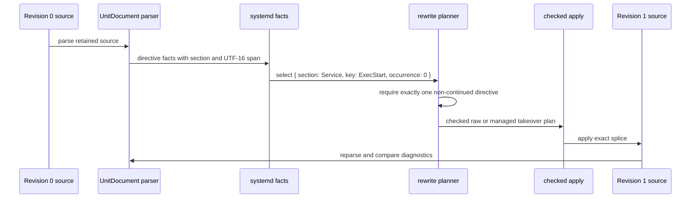

# Retained Revisions, Facts, And Checked Rewrite Passes

## Decision

Generalize `block-in-file` around **immutable retained source revisions**, not
around marker blocks and not around a forward-mutating line stream.

Each revision retains its exact JavaScript string and physical-line index. A
consumer may derive revision-bound facts from that source using any mechanism:
a line fold, a host parser, a regular expression, or a whole-document analysis.
Planners consume one revision and its facts, emit checked edit intents against
that same revision, and the runtime validates and applies them as one new
revision. Dependent work explicitly starts from the new revision.

Managed blocks become one maintained assembly over this model. They remain a
first-class easy path, but they are no longer the reference frame for every
operation. A physical-line transducer becomes an optional **snapshot line-fold
planner**, not the mandatory product model.

## Why Change Direction

The current implementation has a real generic kernel:

- [`apply()`](/src/reconcile/apply.ts) validates checked spans, rejects overlap,
  and splices right to left.
- [`inspect()`](/src/document/inspect.ts) retains source and indexes physical
  lines without reconstructing it.
- [`beginReconciliation()`](/src/reconcile/session.ts) creates fresh immutable
  documents after each successful step.

But its most visible public behavior is still a block-oriented facade:
[`planBlock()`](/src/managed/default.ts) discovers marker regions and renders
marker envelopes. Raw replacement exists largely as the absence of marker
ownership. That framing is too narrow if the library is intended to help a
consumer reason about configuration files, prose, and parser-selected regions
without treating each as a special case of a block.

The stream-processor exploration correctly identifies a missing capability:
state accumulated while visiting source can decide to emit an edit later. Its
literal `Processor<State, Fact, Edit>` proposal is not yet a safe foundation.
It leaves the important semantics implicit: revision ownership, EOF behavior,
inter-pass visibility, fact provenance, and overlap resolution.

## The Core Model

### Revisions Are Coordinate Universes

Every offset, line, span, fact, and planned edit belongs to exactly one source
revision. A revision is immutable. It never gains a shifted coordinate system;
an applied plan creates another revision instead.

```ts
export type RevisionId = string & { readonly revision: unique symbol };

export type SourceRevision = Readonly<{
  id: RevisionId;
  text: string;
  lines: readonly PhysicalLine[];
}>;

export type RevisionSpan = Readonly<{
  revision: RevisionId;
  start: number;
  end: number;
}>;
```

`RevisionId` is an opaque runtime identity, not a content hash promise. Two
separately inspected equal strings may have distinct identities. This prevents
callers from accidentally applying a span or fact from an older revision simply
because its text happens to look similar.

The current `Document` is the beginning of `SourceRevision`. The refinement is
to make revision affinity explicit at public boundaries rather than relying on
callers to remember which `text` produced a numeric offset.

### Facts Are Evidence, Not A Global Object Store

A fact is an observation about one revision. It may be located, document-wide,
or supplied by a host parser. A fact batch keeps it attached to its revision
without requiring a mutable fact database or a universal schema.

```ts
export type Fact<Kind extends string, Value> = Readonly<{
  kind: Kind;
  subject?: RevisionSpan;
  value: Value;
  origin: string;
}>;

export type FactBatch<FactValue> = Readonly<{
  revision: RevisionId;
  facts: readonly FactValue[];
  diagnostics: readonly InspectDiagnostic[];
}>;
```

Examples:

- a marker scanner emits `managed-block` facts with envelope and payload spans;
- a line fold emits `heading`, `blank-line`, or `fence` facts;
- a systemd adapter emits `systemd.directive` facts with section, key,
  occurrence, continuation state, and a converted source span;
- a whole-document check emits a `missing-license` fact with no local subject.

Facts do not silently persist into another revision. A planner may only consume
fact batches with the same revision identity as its document. A later revision
must be analyzed again. This makes stale-source behavior a normal type and
runtime condition instead of hidden offset arithmetic.

### Edits Are Checked Actions With Provenance

An edit reaches the mutation boundary only as a checked range against the
revision's retained string. The existing `PlannedEdit` shape already provides
the required `expected` snapshot. A generalized form adds explanation, not a
new application mechanism.

```ts
export type EditIntent = Readonly<{
  revision: RevisionId;
  range: CheckedSpan;
  replacement: string;
  reason: string;
  origin: string;
  evidence?: readonly string[];
}>;

export type RewritePlan = Readonly<{
  revision: RevisionId;
  edits: readonly EditIntent[];
}>;
```

`origin` names the assembly or pass that made the decision. `evidence` is a
future-friendly link to the facts used to make it. Neither authorizes an edit:
the runtime still checks bounds, exact expected text, and non-overlap before
splicing. Coincident insertions and overlapping transformations remain a
structured conflict, never an implicit processor-order rule.

### Passes Read Snapshots And Produce Results

A pass does not mutate its input. It receives a revision and explicitly supplied
facts, then produces more facts, diagnostics, and optionally a plan.

```ts
export type PassContext<Facts> = Readonly<{
  revision: SourceRevision;
  facts: Facts;
}>;

export type PassResult<NewFacts> = Readonly<{
  facts?: readonly NewFacts[];
  diagnostics?: readonly InspectDiagnostic[];
  plan?: RewritePlan;
}>;

export type SnapshotPass<InputFacts, NewFacts> = Readonly<{
  name: string;
  run(context: PassContext<InputFacts>): PassResult<NewFacts>;
}>;
```

This is intentionally not a public plugin ABI yet. It is the internal
organizing model for maintained assemblies. Its important rule is simple:
**all facts and all edits from one pass describe the input revision, and that
pass cannot observe its own edits.**

If pass B must observe pass A's result, the coordinator applies A's plan,
inspects revision B, then invokes B against its fresh facts. This is the useful
part of the existing `ReconciliationSession`, made explicit.

## Where A Transducer Fits

Physical lines remain valuable because they are exact, exhaustive source
coordinates and make scoped, deferred decisions easy. The promoted form should
be a snapshot fold with an EOF hook, not a rewriting stream:

```ts
export type SnapshotLinePass<State, FactValue> = Readonly<{
  name: string;
  initial(revision: SourceRevision): State;
  line(state: State, line: PhysicalLine, emit: LineEmitter<FactValue>): State;
  finish(state: State, emit: LineEmitter<FactValue>): void;
}>;

export type LineEmitter<FactValue> = Readonly<{
  fact(fact: FactValue): void;
  edit(edit: EditIntent): void;
  diagnostic(diagnostic: InspectDiagnostic): void;
}>;
```

This has the desired transducer-like property: state can hold a pending action
when a trigger is encountered and emit it on a later line or at EOF. It does
not have a mutable streaming-output claim. Every emission remains anchored to
the input revision, then becomes part of one checked plan. No emitted edit
changes the lines seen later in the same pass.

`finish()` is mandatory. It is where a pass can emit a deferred EOF insertion,
report an unclosed fence, or reject an incomplete scope. A bare
`advance(state, line)` processor cannot express those cases correctly.

## Grounding: A Systemd `ExecStart` Rewrite

The model does not ask a generic line walker to understand systemd. The systemd
parser remains semantic authority.



Concretely:

1. `UnitDocument` reads `[Service]` while parsing and keeps that section as
   context for each directive. The generic library does not need to discover
   the header itself.
2. The N-API adapter exposes each directive's whole source range as UTF-16
   code-unit offsets. It includes directive indentation and trailing whitespace
   but excludes the physical terminator.
3. The systemd assembly turns that record into a revision-bound
   `systemd.directive` fact. Its selection policy is explicit:
   `{ section: "Service", key: "ExecStart", occurrence: 0 }` must resolve to
   exactly one fact.
4. A planner derives `CheckedSpan.expected` from the retained revision text and
   emits a raw replacement or a line-aligned managed take-over intent.
5. Applying the plan creates revision 1. The assembly reparses revision 1 and
   rejects a new diagnostic, a continued directive, ambiguity, or a result
   outside the requested section.

The answer to “where does `ExecStart=` go?” is therefore not “after a generic
forward walker sees `[Service]`.” It is “the systemd parser produces a directive
fact whose section context and source range prove exactly where it is.” A line
pass can model simpler header formats; it must not displace a host parser when
one already knows the syntax.

## Variations Considered

| Direction                                  | Strength                                                                                                         | Cost and reason not to choose as spine                                                                                                          |
| ------------------------------------------ | ---------------------------------------------------------------------------------------------------------------- | ----------------------------------------------------------------------------------------------------------------------------------------------- |
| Forward rewriting transducer               | Natural deferred emission and streaming intuition.                                                               | Edits change later coordinates, parser facts cannot participate naturally, and same-pass visibility is difficult to define. Reject as the core. |
| Retained-revision facts and checked passes | Works for line folds, parser adapters, regex/whole-document analysis, and blocks. Reuses the correctness kernel. | Requires explicit revision and plan provenance. **Recommended.**                                                                                |
| Fact graph or relational rewrite database  | Powerful queries, dependencies, multi-file coordination, explanation.                                            | Requires a schema, query language, invalidation model, and transaction design before evidence. Defer.                                           |
| Full editor or syntax-tree framework       | Strong structural transformations.                                                                               | Recreates format parsers and abandons lossless text as the shared denominator. Reject.                                                          |
| Public plugin/event framework              | Extensible by third parties.                                                                                     | Freezes lifecycle and conflict semantics before maintained assemblies have established them. Defer.                                             |

## Annealing Plan

1. **Make revision affinity real internally.** Introduce opaque revision IDs and
   revision-bound source spans, fact batches, and plans. Retain existing public
   conveniences while the internals settle.
2. **Separate assemblies from the kernel.** Move marker ownership behind a
   managed assembly boundary. The root package may keep it as the default
   facade; `block-in-file/toolkit` becomes the honest general entry point.
3. **Ship the systemd assembly.** It is the first proof that externally parsed
   semantic facts can become checked generic edits without teaching the kernel
   systemd semantics.
4. **Write one non-parser line-fold assembly.** A Markdown changelog editor is
   a good probe: it tracks headings, waits for a later boundary, and emits a
   deferred insertion. Keep its pass type private.
5. **Compare the two assemblies.** Promote `SnapshotLinePass` only if the
   Markdown assembly's collector and the managed scanner share a stable shape.
   Do not force the systemd parser through it.
6. **Characterize conflicts and reports.** Before public pass APIs, prove facts
   and edits from independent passes report origins, stale revisions, EOF
   decisions, Unicode spans, mixed terminators, and overlap conflicts
   deterministically.

## Consequences

- The library can still satisfy ordinary `block-in-file` callers. Managed blocks
  are a pre-built rewrite assembly, not a discarded feature.
- “Arbitrary things while walking a file” becomes possible through snapshot line
  folds with deferred emissions, without corrupting coordinate semantics.
- Host parsers are welcome fact producers. The core need not choose between
  physical lines and semantic structure.
- A real public processor framework remains deferred, but its eventual shape is
  constrained by explicit principles rather than only two accidental examples.
- The next work is foundational, not another mode flag: revision-bound facts,
  edit provenance, and assembly boundaries.

## Open Questions

1. Should `RevisionId` be an opaque incrementing runtime token, or should a
   content fingerprint be separately available for reporting and caching?
2. Is edit provenance sufficient as strings initially, or should maintained
   assemblies use structured origin records from the beginning?
3. Should a pass be allowed to return one plan only, or a named set of plans
   with an explicit dependency graph? Begin with one plan and fresh revisions.
4. Can two independently useful line-fold assemblies demonstrate the same
   `SnapshotLinePass` collector without turning it into a plugin framework?

## Bottom Line

The principled generalization is not “blocks with more options” and not an
eager mutable transducer runtime. It is a **lossless retained-revision rewrite
library**: source revisions carry coordinates; facts describe evidence about a
revision; checked edits explain and prove transformations; passes explicitly
cross revision boundaries.

That model subsumes managed blocks, supports the systemd parser bridge, and
leaves room for transducer-like line folds where they are genuinely the right
assembly.
