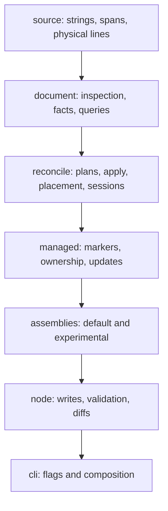

# block-in-file v2: lossless text reconciliation

## Decision

Build `block-in-file` v2 as a pure TypeScript text-reconciliation library. It
retains a JavaScript source string, inspects it without reconstructing it, plans
checked edits against that exact source, and applies those edits while retaining
every untouched UTF-16 code unit exactly.

Managed marker blocks are the default durable-ownership feature, not the whole
product. The same runtime supports deliberate raw edits, adoption of existing
text, and explicit take-over. The CLI becomes the default assembly over this
runtime. `systemd-units` is a thin proof consumer that retains every systemd
syntax and semantic decision.

The design is organized around one lifecycle:


The lifecycle is the API's value. Modules, policies, and assemblies exist to
make this lifecycle safe and useful, not to create a generic parsing framework.

## Goals

1. Preserve untouched source code units, including LF, CRLF, lone CR, mixed
   terminators, and final-newline absence.
2. Give callers one source of truth for coordinates, marker integrity,
   stale-selection detection, placement, and splice ordering.
3. Support visible, idempotent managed ownership and intentional unmarked edits
   without silently converting between them.
4. Support state accumulated while walking physical lines, so an assembly can
   derive facts such as entering a scope, its final entry, and trailing trivia.
5. Keep the pure runtime independent of Node effects, environment substitution,
   clocks, files, and host-format semantics.
6. Let the existing CLI remain familiar by translating flags into policies at
   its boundary instead of preserving its parser loop as the core.

## Non-Goals

- A formatter, normalizer, AST, or general syntax parser.
- Systemd, nginx, INI, SSH, YAML, or TOML semantics in the core.
- A best-effort replacement, implicit first/last match, or replace-all raw
  operation.
- A public plugin framework, event bus, builder, watch API, streaming API,
  Buffer API, CRDT, undo model, or Rust rewrite before working consumers prove
  the need.
- A claim that a textual insertion is a systemd semantic override.

## What The Runtime Hides

The deletion test defines the deep module: if the runtime disappeared, every
consumer would need to reimplement the following concerns correctly.

| Caller intent | Runtime work the caller does not reimplement |
| --- | --- |
| Update a named block | Marker discovery, tag-aware identity, malformed-marker detection, replacement range, and no-op detection. |
| Take over selected existing text | Checked-span validation, marker envelope rendering, line-ending selection, and exact splice. |
| Replace a raw target | Bounds checks, stale-source detection, overlap rejection, and right-to-left application. |
| Insert after the final entry in a scope | Physical-line indexing, contextual state, scope facts, trailing-boundary calculation, and placement validation. |
| Compose several dependent edits | Fresh immutable inspection after each in-memory step, preserving valid coordinates without hidden offset arithmetic. |
| Preview a write | A reviewable plan and change report without file I/O or a partial write. |

Consumers own their intent and, where necessary, their host-format selection.
The runtime owns lossless source mechanics.

## Source And Coordinate Contract

The v2 core operates on JavaScript strings. Every public source offset is a
UTF-16 code-unit offset suitable for `String.prototype.slice(start, end)`.

```ts
export type SourceSpan = Readonly<{
  start: number;
  end: number;
}>;

export type CheckedSpan = Readonly<{
  start: number;
  end: number;
  expected: string;
}>;

export type PhysicalLine = Readonly<{
  number: number;
  text: string;
  span: SourceSpan;
  terminator: "\n" | "\r\n" | "\r" | "";
}>;
```

The core is therefore **UTF-16 code-unit preserving**, not intrinsically byte
preserving. A Node writer may preserve encoded bytes when it writes the same
encoding without normalization. The public library guarantee is stronger and
more precise for its actual input type: untouched code units return unchanged.

`PhysicalLine` is an exact partition of source. `text` excludes the terminator;
the empty terminator represents a final line with no trailing newline. No public
operation represents source as `string[]` and reconstructs it later.

### Preservation Rules

1. A successful edit changes only its replacement ranges.
2. A no-op returns the original string and reports `changed: false`.
3. Existing terminators are never normalized.
4. Generated multiline content has an explicit line-ending policy. The default
   `inherit` policy chooses the nearest neighboring terminator, then the first
   terminator in the document, then `"\n"` for an empty document.
5. Marker envelopes are line-oriented and require line-aligned target ranges.
   Raw checked replacements may address any valid code-unit range.

## Inspect, Facts, And Queries

`inspect()` produces an immutable source-backed `Document`. The document is an
index into retained source, never a rendering model.

```ts
export type Document = Readonly<{
  text: string;
  lines: readonly PhysicalLine[];
  blocks: readonly ManagedBlock[];
  diagnostics: readonly InspectDiagnostic[];
  facts: readonly DerivedFact[];
}>;

export function inspect(
  text: string,
  assembly: InspectionAssembly,
): Document;
```

`ManagedBlock`, scope facts, entries, comments, anchors, and caller-defined
facts all retain exact source spans. Physical lines are the only exhaustive
partition required by the runtime. Derived facts may overlap or nest; the core
does not force opaque source into an exhaustive `RegionKind` taxonomy.

Queries make cardinality explicit:

```ts
export type QueryResult<Value> =
  | Readonly<{ kind: "one"; value: Value }>
  | Readonly<{ kind: "absent" }>
  | Readonly<{ kind: "ambiguous"; values: readonly Value[] }>;
```

An operation that requires one target accepts only `kind: "one"`. Selection of
the first, last, or all results is a caller-visible query policy, never a hidden
fallback in the runtime.

## Context Tracking And Scope Facts

The primitive for modular state tracking is a physical-line walk. It owns line
coordinates and exact ordering; a caller-owned tracker owns what the state
means.

```ts
export type ContextTracker<State> = Readonly<{
  initial(): State;
  advance(state: State, line: PhysicalLine): State;
}>;

export type ContextualLine<State> = Readonly<{
  line: PhysicalLine;
  before: State;
  after: State;
}>;

export function walk<State>(
  document: Document,
  tracker: ContextTracker<State>,
): readonly ContextualLine<State>[];
```

This is deliberately more general than a permanent `SectionDialect`. A systemd
assembly can track current section, entries, and trailing trivia. A brace-based
consumer can track nesting. The core names neither form.

An experimental scope helper may derive `ScopeFact` values and offer
`walkScopes()` with `onEnter` and `onExit` callbacks. `onExit` is a convenient
imperative form of "last call in this scope," but the published state sequence
is the primitive. A lifecycle event bus is unnecessary: stale spans and marker
conflicts are result data, and lifecycle state is queryable fact data.

## Inspectors And Current-Code Migration

Inspection is implemented internally from small composable pieces. These are
initially maintained implementation components, not a general public plugin
ABI.

| Component | Responsibility | Current implementation it replaces |
| --- | --- | --- |
| `markerScanner` | Find marker lines and assemble strict block facts. | Inline opener/closer state in [`block-parser.ts`](https://github.com/jauntywunderkind/block-in-file/blob/main/src/block-parser.ts). |
| `tagParser` | Parse marker tags and derive a tag-stripped marker base. | `src/tags/`. |
| `anchorParser` | Derive anchor metadata from marker tags. | [`anchor.ts`](https://github.com/jauntywunderkind/block-in-file/blob/main/src/anchor.ts). |
| `lineClassifier` | Derive caller-defined structural facts from physical lines. | New capability; not systemd knowledge. |
| `ContextTracker` | Publish state transitions across exact physical lines. | Parser-loop local state. |

Marker identity is canonical: two marker lines identify the same managed block
when their tag-stripped bases match under the selected marker dialect. Tags may
change across runs without turning an existing block into a second block.

Strict marker inspection reports, rather than repairs:

- duplicate matching block identities;
- nested blocks;
- orphaned openers or closers; and
- mismatched marker pairs.

## Planning And Application

An `EditPlan` is the single mutation boundary for a one-shot operation.

```ts
export type PlannedEdit = Readonly<{
  range: CheckedSpan;
  replacement: string;
  reason: string;
}>;

export type EditPlan = Readonly<{
  source: string;
  edits: readonly PlannedEdit[];
}>;

export type ApplyFailure =
  | Readonly<{ code: "stale-span"; range: SourceSpan; expected: string; actual: string }>
  | Readonly<{ code: "span-out-of-bounds"; range: SourceSpan }>
  | Readonly<{ code: "overlapping-edits"; ranges: readonly SourceSpan[] }>;

export type Change = Readonly<{
  text: string;
  changed: boolean;
  edits: readonly SourceSpan[];
}>;

export function apply(plan: EditPlan): Change | ApplyFailure;
```

`apply()` validates every range against `plan.source`, rejects overlaps, then
splices right to left. It never searches to recover from a stale plan. Managed
and raw operations both reduce to planned edits and this one splice engine.

## Placement

Placement is policy over inspected facts, not an incidental branch in marker
parsing.

```ts
export type Placement =
  | Readonly<{ kind: "offset"; at: number }>
  | Readonly<{ kind: "edge"; edge: "BOF" | "EOF" }>
  | Readonly<{
      kind: "line-match";
      pattern: RegExp;
      relation: "before" | "after";
      cardinality: "unique-or-error";
    }>
  | Readonly<{ kind: "anchor"; anchor: AnchorInfo }>
  | Readonly<{
      kind: "relative";
      target: FactReference;
      relation: "before" | "after" | "before-last-entry" | "after-last-entry";
    }>;

export function resolvePlacement(
  document: Document,
  placement: Placement,
): number | PlacementFailure;
```

`relative` placement is how an assembly can express "after the last entry in
this scope" without teaching the core about systemd. It is promoted with the
first maintained scope assembly, not before. A relative target must resolve
uniquely and must specify what counts as an entry through assembly facts.

## Ownership Operations

Ownership is explicit. The library never falls back from a managed operation to
a raw operation, never adds markers because it cannot prove a raw target, and
never invents durable identity for raw text.

| Operation | Intent | Result |
| --- | --- | --- |
| Managed insert/update | Own generated content across runs. | Named marker-delimited block. |
| Adopt | Begin managing known source without changing its payload. | Existing checked source wrapped in markers. |
| Take over | Replace selected known source with owned generated content. | Checked span replaced by a managed block. |
| Raw edit | Make an intentional unmarked source change. | Checked insert, replacement, or deletion without persistent identity. |

Raw operations have no inherent idempotence claim. A caller that needs idempotent
raw behavior must supply a query that proves the desired source state.

### Managed Request

The friendly default assembly exposes its branching choices, rather than hiding
them in a bag of flags:

```ts
export type BlockRequest = Readonly<{
  block: Readonly<{
    name: string;
    dialect: MarkerDialect;
    content: string;
  }>;
  whenPresent: Readonly<{
    kind: "update" | "keep" | "remove" | "error";
    update?: UpdatePolicy;
  }>;
  whenMissing:
    | Readonly<{ kind: "insert"; placement: Placement }>
    | Readonly<{
        kind: "take-over";
        span: CheckedSpan;
        mode: "adopt" | "replace";
      }>
    | Readonly<{ kind: "skip" | "error" }>;
}>;

export type ManagedOutcome =
  | "updated"
  | "inserted"
  | "adopted"
  | "replaced"
  | "removed"
  | "kept"
  | "skipped";

export type ManagedChange = Change & Readonly<{
  outcome: ManagedOutcome;
  block: ManagedBlock | undefined;
}>;
```

The resolution order is fixed:

1. Inspect marker integrity.
2. Resolve a uniquely matching existing managed block by tag-stripped identity.
3. If one exists, apply `whenPresent` and ignore any unmanaged take-over span.
4. If none exists, apply `whenMissing`.
5. A take-over span must satisfy `text.slice(start, end) === expected`.

This prevents an old unmanaged target from overwriting content that was already
placed under durable management.

## Reconciliation Sessions

One `EditPlan` handles independent non-overlapping edits against one source.
Dependent edits need a different abstraction: the first edit may create or move
a target that the next edit needs to inspect, so queuing original offsets is
unsound.

`ReconciliationSession` composes safely by retaining immutable revisions:

```ts
const session = beginReconciliation(source, defaultAssembly);

session.reconcileBlock(firstRequest);
session.replace(secondTarget, replacement);
session.reconcileBlock(thirdRequest);

const preview = session.preview();
const result = session.commit();
```

Each successful session step:

1. plans against the current `Document`;
2. applies that checked plan in memory;
3. retains the plan and change report; and
4. inspects the new source as the next immutable `Document`.

`preview()` returns the final in-memory source plus step reports. `commit()`
returns the same result; it does not perform I/O. A caller writes once and a
host adapter reparses once after the full session. A failed step returns its
structured failure and no committed partial result.

This favors re-inspection over hidden offset shifting. Configuration files are
small, and a valid coordinate model is more valuable than clever batching.

## Modes Are Vocabulary, Not Separate Engines

The library documents familiar modes because they describe caller intent. They
are shapes over the same inspect-query-plan-apply lifecycle.

| Mode | Lifecycle shape | Stable initially? |
| --- | --- | --- |
| `audit`, `list`, `find` | inspect + query | Yes, as `Document` and query reports. |
| `validate` | inspect diagnostics | Yes, for marker integrity. |
| `diff` | inspect + plan, rendered by Node presentation helpers | Yes, as composition. |
| `ensure`, `update`, `remove`, `adopt`, `take-over` | managed planning + apply | Yes, through the default assembly and toolkit operations. |
| `raw` | checked raw planning + apply | Yes. |
| `migrate` | a multi-step session | Candidate; promote with a real migration consumer. |
| `watch` | live external source monitoring | Deferred. |

This gives the product a legible API without duplicating implementation in a
mode-specific framework.

## Content Preparation And Effects

Content is prepared before planning. Environment substitution, timestamp tags,
and clocks are caller or CLI concerns. The core receives literal desired
content and is deterministic.

Node-only utilities operate after planning or applying:

| Concern | Owner |
| --- | --- |
| Atomic write, backup, attributes, external validation command | `block-in-file/node` |
| Diff formatting and presentation | `block-in-file/node` |
| Environment substitution and clock acquisition | CLI or embedding caller |
| Marker rendering, merge policy, placement, marker integrity | Pure runtime |

The CLI translates its current flags into these policies:

| Existing concern | v2 home |
| --- | --- |
| Update or insert | `BlockRequest` present/missing policies. |
| `--additive` and ordering | `UpdatePolicy` / merge policy. |
| Tags and timestamps | Marker rendering; injected clock. |
| `--anchor` | Anchor placement policy. |
| `--before`, `--after`, BOF, EOF | `Placement`. |
| Removal and orphan cleanup | Explicit CLI policy over strict inspection and managed removal. |
| `ensure`, `only`, `none` | CLI decision over managed outcome metadata. |
| Backup, validate, attributes, diff | Node-only orchestration. |

## Module Topology

The source tree is grouped by domain responsibility. Dependency direction is
downward toward retained source and exact application.



```text
src/
  source/
    spans.ts            UTF-16 spans and checked-range validation
    lines.ts            exact physical-line index and insertion terminators
  document/
    inspect.ts          immutable Document construction
    markers.ts          strict marker facts, tags, and identity
    context.ts          ContextTracker walk and contextual facts
    query.ts            cardinality-aware queries
  reconcile/
    plan.ts             planned edit data and failures
    apply.ts            validated right-to-left splice engine
    placement.ts        offset, edge, match, anchor, and relative policies
    session.ts          immutable-revision ReconciliationSession
  managed/
    ownership.ts        insert, adopt, take-over, removal
    update.ts           replacement and additive merge policy
    default.ts          BlockRequest facade
  assemblies/
    experimental/       maintained novel assemblies before promotion
  node/
    write.ts            atomic file choreography and backup
    validate.ts         external validation command
    diff.ts             presentation-only diff
  cli/
    command.ts          argument translation and composition
```

`source`, `document`, `reconcile`, `managed`, and `assemblies` are pure. They
never import `node:fs`, read environment variables, acquire a clock, run a
command, or log. `node` depends on pure domains; `cli` depends on both.

Initial exports reflect this boundary:

| Subpath | Contents |
| --- | --- |
| `block-in-file` | Default managed-block assembly. |
| `block-in-file/toolkit` | Source inspection, planning, application, sessions, and supported generic helpers. |
| `block-in-file/node` | Node-only file choreography and presentation utilities. |

## Systemd Adapter

`systemd-units` remains the semantic authority. The adapter is an opt-in
subpath that composes existing capabilities; it is not an alternative parser or
schema engine.


The first adapter supports one explicitly selected whole directive. It:

1. obtains the selected directive range from `UnitDocument`;
2. converts the Rust UTF-8 byte range to a UTF-16 `CheckedSpan` against the
   rendered JavaScript source;
3. applies raw replacement, adoption, or managed take-over;
4. reparses the final source; and
5. rejects newly introduced diagnostics and a managed block outside the
   selected section context.

It rejects ambiguous selection and continued directives until the document
module exposes correct whole-directive ranges for them. Repeated, resettable,
additive, and command-list directive semantics remain systemd-specific work.

The generic `ContextTracker` and experimental scope facts can prove contextual
placement on systemd-like fixtures. They must not replace `UnitDocument` as the
authority for selecting an actual systemd directive.

## Promotion Gates

The runtime needs room to grow without publishing an accidental framework. A
capability remains local to an experimental assembly or adapter until it meets
at least one gate:

1. Two maintained consumers use the same tracker, scope helper, placement
   policy, or rendering behavior unchanged.
2. Multiple consumers need the same query vocabulary and its ambiguity rules can
   be stated without naming a host format.
3. The capability removes material caller complexity rather than wrapping a
   trivial predicate or callback.
4. Its preservation, cardinality, and failure rules have fixtures independent
   of a single host format.

| Deferred capability | Promote when |
| --- | --- |
| Scope visitor helper | A maintained scope assembly proves its facts and one other consumer needs the same interaction model. |
| Built-in dialects | Two consumers use the same dialect unchanged. |
| Builder/fluent API | Real sessions demonstrate a stable ergonomic pattern over one release. |
| Lifecycle event bus | Queryable facts and the scope helper cannot express a demonstrated consumer need. |
| Public inspector/plugin ABI | Two independent assemblies require external behavior authoring. |
| `migrate` mode | A real multi-span migration has a defined rollback and reporting contract. |
| Rust core | The proven TypeScript core exposes a correctness or performance problem a Rust implementation resolves. |

## Delivery Plan

1. **Characterize legacy behavior.** Preserve intended CLI semantics as tests;
   identify line-array representation accidents that v2 intentionally changes.
2. **Prove source preservation.** Implement physical lines, checked plans, and
   application. Cover LF, CRLF, lone CR, mixed endings, empty input, absent final
   newline, Unicode, stale spans, overlapping plans, and no-op identity.
3. **Build strict managed ownership.** Implement marker inspection, tag-stripped
   identity, default present/missing policies, managed insert/update/remove,
   adoption, and take-over.
4. **Migrate CLI and effects.** Move flags to pure policies and Node-only
   orchestration; publish the default and toolkit subpaths with declarations.
5. **Add raw operations and sessions.** Prove raw and managed replacement differ
   only by marker rendering, then prove dependent session steps receive fresh
   documents and culminate in one external write boundary.
6. **Prove contextual inspection.** Add `ContextTracker` and one maintained
   generic scope assembly with final-entry and trailing-trivia facts.
7. **Build the systemd adapter.** Depend on whole-directive document ranges;
   prove range conversion, explicit selection, reparse diagnostic delta, and
   section-context placement.
8. **Promote only earned extensions.** Apply the gates before adding dialects,
   builders, lifecycle events, or a plugin ABI.

## Acceptance Evidence

The architecture is ready for consumers only when it proves:

1. Every untouched UTF-16 code unit survives managed and raw transformations.
2. Marker corruption, stale spans, invalid ranges, overlapping plans, and
   ambiguous queries return structured failures without transforming source.
3. Existing managed identity wins over a proposed unmanaged take-over span.
4. A raw `replace` and a managed `take-over` of the same target differ only by
   the rendered marker envelope and requested managed content.
5. A session re-inspects after each successful in-memory revision, so a later
   operation cannot consume an offset from an invalidated document.
6. A `ContextTracker` can derive scope entry, final entry, and trailing boundary
   facts from exact physical lines without core knowledge of the host format.
7. The CLI's intended characterization suite passes through the default assembly
   while CRLF and no-final-newline fixtures gain the v2 preservation behavior.
8. The systemd adapter rejects ambiguous or unsupported selections, preserves
   non-ASCII range selection through UTF-8-to-UTF-16 conversion, and fails when
   the final reparse gains diagnostics.

## Bottom Line

`block-in-file` v2 is a deep, lossless source-reconciliation library. It gives
ordinary callers a safe managed-block facade and advanced callers a coherent
toolkit for inspection, query, checked planning, exact application, and
revision-safe composition. It offers raw edits without pretending raw text has
managed identity, and contextual state without learning systemd or becoming a
plugin framework.

The CLI demonstrates the default assembly. `systemd-units` proves the seam.
The library's enduring product is the hard source-preservation work that neither
consumer should need to rebuild.

# Addendum: Systemd Adapter Boundary

The first library slice is sufficient for a `systemd-units` adapter to perform
one checked raw replacement: `replaceChecked(text, { span, replacement })`
accepts a UTF-16 code-unit `CheckedSpan`, verifies its retained text, and does
not search, normalize, or infer a target. The adapter must continue to own
systemd selection, UTF-8-byte-to-UTF-16 conversion, final reparse, and
diagnostic-delta validation.

Investigation of `systemd-units` found that its public Node API currently
exposes logical directives (`id`, `section`, `key`, `value`, and `continued`)
but not a whole-directive source range. Its Rust document ranges are UTF-8 byte
offsets, while the JavaScript toolkit correctly uses UTF-16 code-unit offsets.
The adapter must therefore wait for `systemd-units` to expose a selected,
single-line whole-directive byte range. It must reject continued directives
until that range model includes all physical fragments and intervening trivia.

The implementation sequence is now:

1. Expose a document-local whole-directive UTF-8 byte range from
   `systemd-units`, preserving its explicit duplicate-directive selection.
2. In `systemd-units`, select exactly one `{ section, key, occurrence }`,
   reject ambiguity and `continued: true`, then convert that range to a
   `CheckedSpan` against the rendered JavaScript string.
3. Call `block-in-file/toolkit`'s `replaceChecked()` for raw replacement, or
   use the root managed facade for line-aligned adoption/take-over.
4. Reparse the returned source and reject a newly introduced diagnostic or a
   managed block outside the selected section.

This is intentionally not a `systemd-units` parser or adapter in this package.
It keeps the source-reconciliation API format-independent and makes the missing
range capability a visible prerequisite rather than an unsafe approximation.

## References

- [Canonical reconciliation synthesis](/.design/block-in-file/syn-ambition.gpt-5.6-terra.md)
- [GLM synthesis and comparison addenda](/.design/block-in-file/syn-ambition.glm-5.2.md)
- [DeepSeek synthesis and self-critique](/.design/block-in-file/syn-ambition.deepseek-v4-pro.md)
- [Library boundary](/.design/block-in-file/library-boundary.md)
- [Optional systemd integration](/.design/block-in-file/optional-integration.md)
- [Walking skeleton synthesis](/.design/walking/syn.md)
